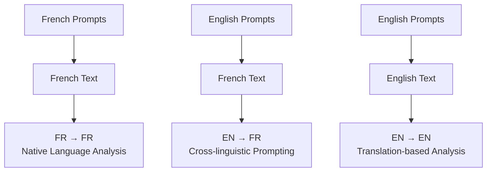

## "Can we use LLMs for sentiment analysis in non-English languages?"

## Research Context

**My broader research: Analyzing media discourse on open-source software**

- Corpus: 2,683 French news articles (1995-2025)
- Need to analyze sentiment over time
- Traditional approach: Lexicoder Sentiment Dictionary
- New possibility: Large Language Models

## The Challenge

**Most LLMs are primarily trained on English data**

|                     |                   |                     |
|---------------------|-------------------|---------------------|
| **95%**             | **6,500+**        | **300M**            |
| of AI research focuses on English | languages worldwide | French speakers globally |

**Can general-purpose LLMs effectively analyze sentiment in non-English texts?**

## Why This Matters

**For researchers:**
- Accessible alternatives to specialized sentiment models
- No need for technical ML expertise
- Reduced computational requirements
- Potential for cross-linguistic analysis

**Broader implications:**
- Democratizing NLP technologies
- Supporting multilingual research
- Reducing English-centric bias in computational social science

## Current Literature Gaps

**What we know:**
- Specialized sentiment models work well for non-English text
- English prompting often improves cross-linguistic performance
- Fine-tuned models outperform general approaches

**What we don't know:**
- Can foundation models handle non-English sentiment without fine-tuning?
- How do open-source LLMs compare to closed-source options?
- Does prompt language affect French sentiment analysis performance?
- How do LLMs compare to dictionary methods?

## Research Questions

1. Can general-purpose LLMs accurately evaluate sentiment in French texts **without task-specific fine-tuning?**

2. Can **open-source** general-purpose LLMs accurately evaluate sentiment in French texts?

3. How does the **language of the prompt** affect performance?

## Our Approach

**Data:**
- 2,683 French news articles on open-source software
- 200 randomly sampled sentences for evaluation
- Manual sentiment annotation (-1.0 to 1.0 scale)
- English translations via Google Translate

**Methods:**
- 11 LLMs (open and closed source)
- 3 linguistic conditions
- 19,800 total prompts
- Compared with dictionary methods
- Multiple evaluation metrics

## Models Evaluated

**Closed Source:**
- Claude 3.5 Haiku (Anthropic)
- Gemini 2.0 Flash (Google)
- DeepSeek Chat
- GPT-4o (OpenAI)

**Open Source:**
- Llama 3.2 (1B)
- Llama 3.2 (3B)
- Gemma 2 (9B)
- Mistral Saba (24B)
- QWQ (32B)
- Llama 3.3 (70B)
- DeepSeek R1 Basic (671B)

## Experimental Design



## Prompt Structure

```
Please analyze the sentiment of the following French text and provide a single 
numerical rating according to this scale:

Sentiment Scale:
-1.0: Strong negative sentiment - highly critical, hostile, or pessimistic content
-0.5: Moderate negative sentiment - somewhat negative, disapproving, or concerned
0.0: Neutral sentiment - factual, balanced, or neither positive nor negative
0.5: Moderate positive sentiment - somewhat positive, approving, or optimistic
1.0: Strong positive sentiment - highly supportive, enthusiastic, or optimistic

[Additional instructions about numerical response format and cultural considerations...]

Here is the text to analyze: [TEXT]
```

## Key Findings: Overall Performance

<!-- ADD FIGURE: Correlation results chart -->

*Key points:*
- DeepSeek Chat achieved highest correlation (r = 0.707)
- Claude 3.5 Haiku, GPT-4o, Gemini 2.0 all showed strong performance (r > 0.65)
- Larger open-source models (DeepSeek R1, Llama 3.3) performed reasonably well
- English Dictionary outperformed many smaller open-source models

## Performance by Linguistic Condition

<!-- ADD FIGURE: Linguistic conditions comparison -->

**Key Insights:**
- English prompts with French text (EN→FR) performed slightly better
- The advantage was marginal and not statistically significant
- All conditions showed comparable effectiveness
- Direct analysis of French text slightly outperformed translation

## Classification Accuracy

<!-- ADD FIGURE: F1 scores for 7-category vs 3-category -->

*Key findings:*
- All models performed substantially better on 3-category than 7-category classification
- Average F1 score improved from 0.302 to 0.495 (63.9% increase)
- Claude 3.5 Haiku showed strongest fine-grained distinction capabilities
- Models struggled most with "somewhat positive" and "somewhat negative" categories

## LLMs vs. Dictionary Methods

**For Correlation:**
- Top LLMs outperform dictionaries
- DeepSeek Chat: r = 0.707
- English Dictionary: r = 0.531
- French Dictionary: r = 0.426

**For Classification:**
- English Dictionary: F1 = 0.625
- Top LLMs (3-category): F1 ≈ 0.71
- Average LLM (3-category): F1 = 0.495
- Dictionary methods remain competitive

## Parameter Count Matters

<!-- ADD FIGURE: Parameter count vs performance -->

*For open-source models, parameter count strongly predicts performance*

## Temporal Analysis Comparison

<!-- ADD FIGURE: Time series chart -->

*LLM and dictionary methods capture similar temporal patterns in sentiment over time*

## Practical Implications

**For Social Scientists:**
- Leading closed-source LLMs offer strong performance
- Larger open-source models are viable alternatives
- Choose prompt language based on convenience
- Consider task requirements (basic polarity vs. nuance)
- Dictionary methods remain valuable for transparency

**Key Recommendations:**
- Use LLMs when nuanced sentiment intensity matters
- Rely on basic 3-category distinctions, not fine-grained
- Consider dictionary methods for high transparency needs
- Parameter size predicts performance for open models
- Both French and English prompts work effectively

## Limitations

- **Ground truth reliability**: Single annotator, small sample size
- **Generalizability**: French language only, specific domain (news articles on open-source)
- **Method constraints**: Google Translate quality, single prompt structure
- **Computational considerations**: No cost or time efficiency analysis
- **Temporal relevance**: Models evolve rapidly, findings represent a point in time

## Conclusions

**General-purpose LLMs can effectively analyze sentiment in French text without fine-tuning**

**Key Takeaways:**
- Closed-source models show strongest performance
- Larger open-source models are viable alternatives
- Prompt language has minimal impact for French
- All models struggle with fine-grained sentiment distinctions
- Dictionary methods remain competitive for basic polarity

**The Bottom Line:**
LLMs offer accessible, effective sentiment analysis for non-English text, particularly when basic polarity detection is sufficient

## Thank You

### Questions?

Laurence-Olivier M. Foisy  
mail@mfoisy.com  
Université Laval

*With: Camille Pelletier, Étienne Proulx, Sarah-Jane Vincent, Mickael Temporão, Yannick Dufresne*
