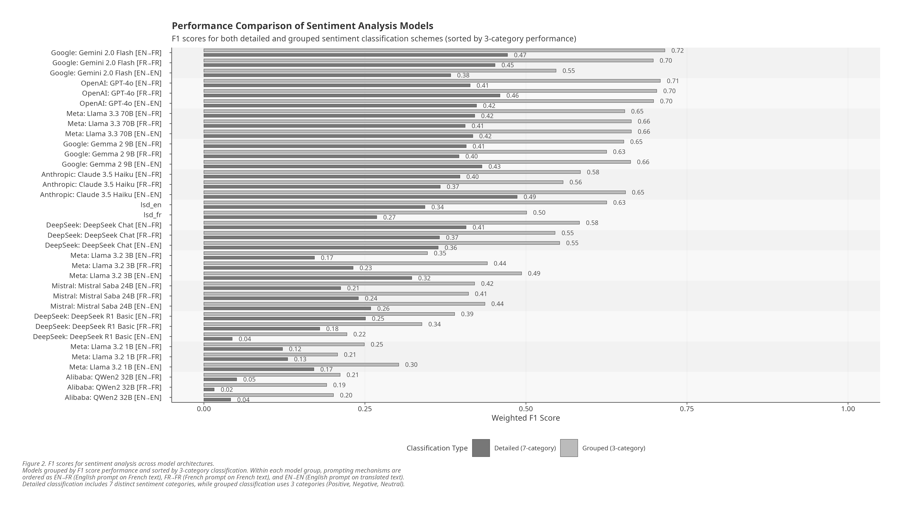

## Research Journey <i class="fas fa-route"></i> 

- Studying media discourse on **Open Source Software** in French.
- Corpus: **2,683** news articles (1995-2025).
- Needed: **Sentiment Analysis** over time.
- Traditional tool: Lexicoder Sentiment Dictionary (LSD).
- *The thought:* What if we used **Large Language Models (LLMs)** instead?

## 


## The Challenge: LLMs & Language <i class="fas fa-language"></i> 

### Most Foundational LLMs

- Predominantly trained on **English** data.
- Performance in other languages? Less certain.

## Our Research Questions <i class="fas fa-crosshairs"></i>

1.  Can **general-purpose LLMs** accurately evaluate sentiment in French texts **without fine-tuning**?
2.  How do **open-source** LLMs perform compared to closed-source?
3.  Does the **language of the prompt** (French vs. English) affect performance?

## Why Does This Matter? <i class="fas fa-users"></i> 

:::: {.columns}

::: {.column width="50%"}

**For Social Scientists:**

- **Accessible Tools:** Alternative to complex models.
- **Lower Barrier:** Less need for ML expertise/compute.
- **Cross-Lingual Potential:** Multilingual research.

:::

::: {.column width="50%"}

**Broader Impact:**

- **Democratizing NLP:** Wider AI access.
- **Supporting Multilingualism:** Reducing English bias.
- **New Methodologies:** Integrating AI into research.

:::

::::

## The Literature Gap <i class="fas fa-puzzle-piece"></i>

:::: {.columns}

::: {.column width="50%"}

**What We Knew:** <i class="fas fa-check"></i>

-   Specialized models work.
-   Fine-tuning helps.
-   English prompts *might* aid cross-lingual tasks.

:::

::: {.column width="50%"}

**What We Didn't Know:** <i class="fas fa-question"></i>

-   **General** LLMs w/o fine-tuning?
-   **Open-source** vs. closed?
-   Impact of **prompt language** for French?
-   LLMs vs. **dictionaries**?

:::

::::


## Approach: Systematic Evaluation <i class="fas fa-cogs"></i> 

:::: {.columns}

::: {.column width="50%"}

<i class="fas fa-database"></i> **Data:** 

- French News Corpus
- 200 annotated sentences
- Manual Annotation (-1 to 1)
- Google Translate

:::

::: {.column width="50%"}

<i class="fas fa-vials"></i> **Methods:** 

- **11 LLMs** (Open/Closed)
- **3 Linguistic Conditions**
- **19,800** Prompts
- Compared: Lexicoder Dictionaries
- Metrics: Corr, MAE, F1 (3/7 cat)

:::

::::

## Before We Begin:

:::: {.columns}

::: {.column width="50%"}

### Warning:

- Take the results with a grain of salt.
- Only 200 sentences
- Single coder

:::

::: {.column width="50%"}


:::

::::


## The Contenders: 11 LLMs <i class="fas fa-robot"></i>

::: {.columns}

:::: {.column width="50%"}

**Closed Source:** <i class="fas fa-lock"></i>

-   Anthropic: Claude 3.5 Haiku
-   Google: Gemini 2.0 Flash
-   DeepSeek Chat
-   OpenAI: GPT-4o

:::

::: {.column width="50%"}

**Open Source (Weights):** <i class="fas fa-lock-open"></i>

-   Meta: Llama 3.2 (1B, 3B)
-   Google: Gemma 2 (9B)
-   Mistral: Saba (24B)
-   Ali Baba: QWQ (32B)
-   Meta: Llama 3.3 (70B)
-   DeepSeek R1 Basic (671B)

:::

::::

## The Experiment: 3 Conditions <i class="fas fa-flask"></i>

```{mermaid}
graph TD
    subgraph "Condition 1: Native"
      A1[French Prompt] --> B1(French Text);
      B1 --> C1["fa:fa-flag → fa:fa-flag"];  // Changed to Mermaid fa: syntax
    end

    subgraph "Condition 2: Cross-Lingual Prompt"
      A2[English Prompt] --> B2(French Text);
      B2 --> C2["fa:fa-flag-usa → fa:fa-flag"]; // Changed to Mermaid fa: syntax
    end

    subgraph "Condition 3: Translation-Based"
      A3[English Prompt] --> B3(English Translation);
      B3 --> C3["fa:fa-flag-usa → fa:fa-flag-usa"]; // Changed to Mermaid fa: syntax
    end
```

## The Prompt Structure <i class="fas fa-scroll"></i>

```{.markdown .code-overflow-wrap .smaller}
Please analyze the sentiment of the following French text and provide a single
numerical rating according to this scale:

Sentiment Scale:
-1.0: Strong negative sentiment...
// ... (Scale definitions) ... //
 1.0: Strong positive sentiment...

Important instructions:
1. ...consider cultural and linguistic nuances...
2. ...analyze emotional tone, word choice...
3. Respond ONLY with a single numerical value...
4. Do not include ANY explanations...

Here is the text to analyze: [TEXT]
```

## Finding 1: Yes, They Can\! <i class="fa-solid fa-check-circle"></i> {.smaller auto-animate="true"}

**Key Points:** <i class="fas fa-star"></i>

  - Top Closed Models (DeepSeek Chat, GPT-4o, Gemini, Claude): **r \> 0.65**
  - Best Open Models (Llama 70B, DeepSeek R1): Competitive
  - English Dictionary (LSD): Solid baseline (r ≈ 0.53)

##


##



## Finding 2: {.smaller}

### Prompt Language? Minimal Impact <i class="fas fa-arrows-left-right"></i>

| Condition     | Avg. Corr | Avg. F1 (3-cat) | Avg. MAE  |
|---------------|------------------|-----------------|----------------------------|
| **🇫🇷 → 🇫🇷** | 0.430            | 0.489           | 0.346                      |
| **🇺🇸 → 🇫🇷** | **0.436** | **0.501** | **0.332** |
| **🇺🇸 → 🇺🇸** | 0.418            | 0.494           | 0.357                      |

**Insight:** <i class="fas fa-lightbulb"></i>

  - English prompts on French text slightly edged out others.
  - **BUT:** Differences were marginal, not statistically significant.
  - **Takeaway:** For French, prompt language choice seems less critical. Direct analysis (🇫🇷 → 🇫🇷 or 🇺🇸 → 🇫🇷) slightly better than translation (🇺🇸 → 🇺🇸).

## Finding 3: Broad Strokes <i class="fas fa-thumbs-up"></i>, Fine Details <i class="fas fa-magnifying-glass"></i><i class="fas fa-thumbs-down"></i>

**Classification Accuracy (F1 Score - Higher is better)**

{fig-align="center" height="450"}

**Key Points:** <i class="fas fa-chart-simple"></i>

  - **Huge jump** from 7-category (nuance) to 3-category (polarity) F1 scores.
  - Avg. F1: **0.302** (7-cat) ↗ **0.495** (3-cat) - **\~64% increase\!**
  - Models excel at **Positive / Neutral / Negative**.
  - Struggle with "somewhat positive/negative".

## Finding 4: LLMs vs. Dictionary <i class="fas fa-balance-scale"></i>

:::: {.columns}

::: {.column width="50%"}

**Correlation (Nuance):** <i class="fas fa-filter"></i>

  - 🥇 **Top LLMs Win:** Better intensity capture (r=0.71).
  - 🥈 LSD Baseline: Less nuanced (EN r=0.53).

:::

::: {.column width="50%"}

**F1 Score (3-Cat Polarity):** <i class="fas fa-check-double"></i>

  - 🥇 **Top LLMs Win (narrowly):** F1 ≈ 0.71.
  - 🥈 **EN LSD Very Competitive:** F1 = 0.625\!

:::

::::

**Insight:** LLMs better for *intensity*, but LSD holds its own for basic *polarity* and offers **transparency**. <i class="fas fa-eye"></i>

## Temporal Trends: LLMs ≈ Dictionary <i class="fas fa-chart-area"></i>

**Sentiment Over Time (Example: Gemini vs. LSD)**

{"center" height="450"}

**Insight:** Despite differences in nuance, top LLMs and dictionary methods capture similar overall sentiment shifts across the corpus.

## So What? Practical Implications <i class="fas fa-wrench"></i> {.smaller}

**For Social Scientists:**

  - <i class="fas fa-check"></i> **Use LLMs:** Top closed & larger open models work *without fine-tuning*.
  - <i class="fas fa-comments"></i> **Prompt Flexibility:** French or English likely fine; direct analysis slightly better.
  - <i class="fas fa-bullseye"></i> **Focus on Polarity:** Rely on Pos/Neut/Neg (3-cat); cautious w/ nuance (7-cat).
  - <i class="fas fa-code-compare"></i> **Consider Trade-offs:**
      - **LLMs:** Nuance <i class="fas fa-arrow-up"></i> Transparency <i class="fas fa-arrow-down"></i>
      - **LSD:** Transparency <i class="fas fa-arrow-up"></i> Nuance <i class="fas fa-arrow-down"></i>

## Keep In Mind: Limitations <i class="fas fa-triangle-exclamation"></i>

:::: {.columns}

::: {.column width="50%"}

- **Ground Truth:** Single coder, small sample.
- **Scope:** French only; News/Open Source domain.
- **Tools:** Google Translate quality?; Single prompt.
    
:::

::: {.column width="50%"}

- **Practicalities:** No cost/time analysis.
- **Snapshot:** LLMs evolve *fast*.

:::

::::

## Conclusion: Bridging the Language Gap <i class="fas fa-flag-checkered"></i> {.smaller}

**Can general-purpose LLMs analyze sentiment in French without fine-tuning?** **Yes.** <i class="fas fa-thumbs-up"></i>

**Key Takeaways:**

  - Leading LLMs offer powerful, *accessible* analysis.
  - Open-source models viable (bigger = better).
  - Prompt language less critical here.
  - Basic polarity = <i class="fas fa-check-circle"></i>; Fine nuance = <i class="fas fa-question-circle"></i>.
  - **LSD remains strong & transparent** for polarity & macro-trends.

**The Bottom Line:** Choose based on **nuance vs. transparency**. LLMs are valuable tools for non-English text.

## Thank You\! <i class="fas fa-handshake"></i>

**Questions?** <i class="fas fa-comments"></i>

Laurence-Olivier M. Foisy
`mail@mfoisy.com`

[mfoisy.com](https://mfoisy.com)

*Co-authors: Camille Pelletier, Étienne Proulx, Sarah-Jane Vincent, Mickael Temporão, Yannick Dufresne*

*Full paper/details available in [GitHub](https://github.com/clessn/mpsa_beyond_language)*

