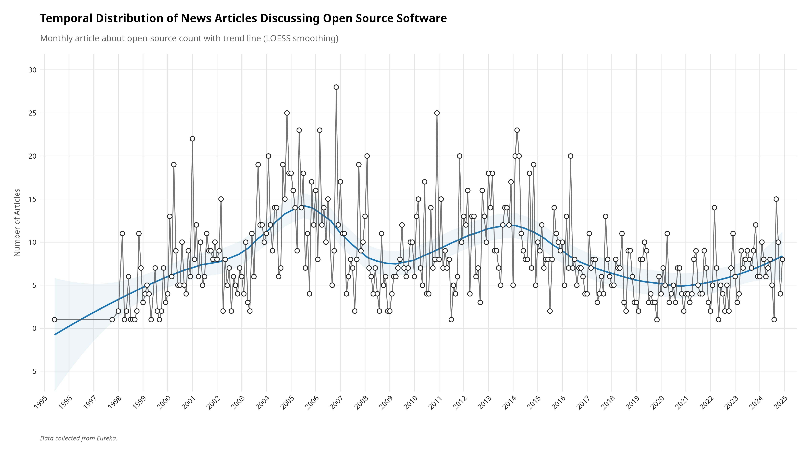
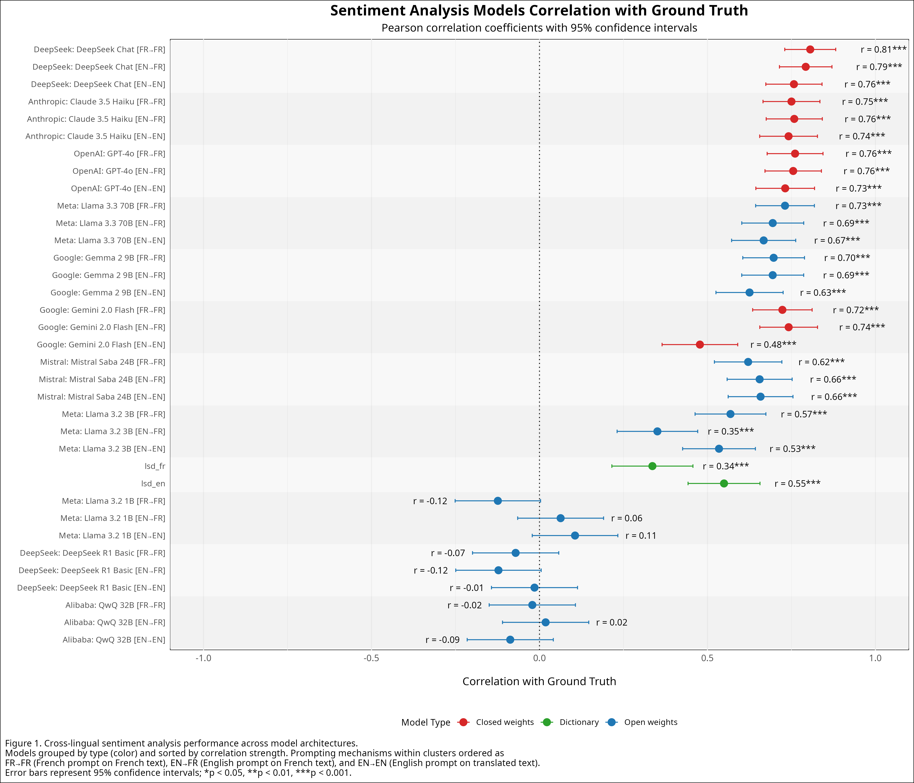
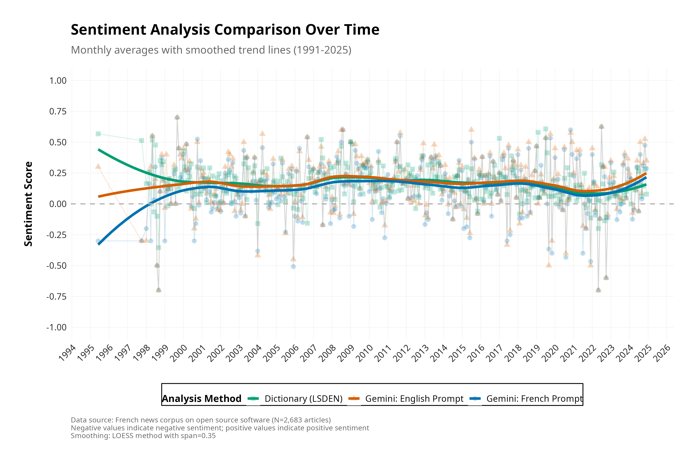
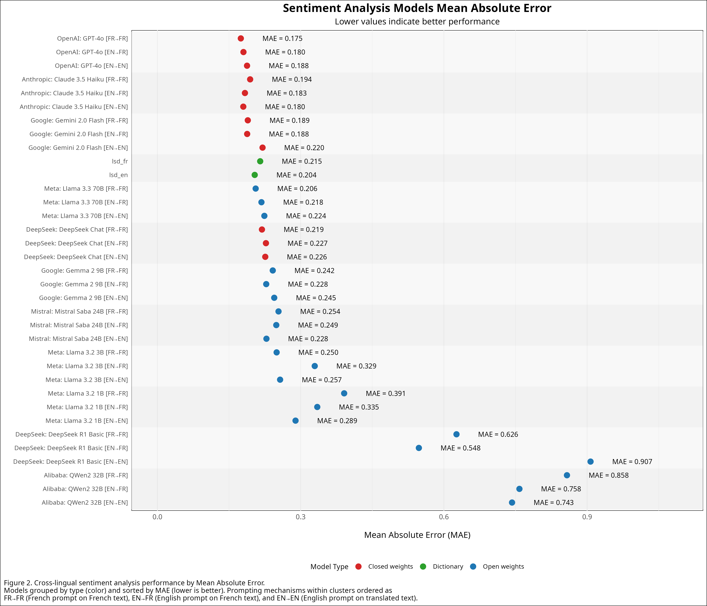

# Introduction

The rise of large language models (LLMs) has transformed natural language processing across domains and applications. 
While these models demonstrate impressive capabilities in non-English languages, their cross-linguistic effectiveness remains a critical area of investigation. 
Indeed, the majority of foundational LLMs, such as Meta AI's Llama models, are predominantly trained on English data [@touvron_etal23a], raising questions about their performance in other languages.

This paper addresses a fundamental question in this domain: Can open and closed-source general-purpose foundational LLMs accurately evaluate sentiment in non-English texts?^[While 'open source' traditionally implies access aligned with FOSS principles, its usage within the LLM context often refers more specifically to the public release of model weights, a condition more accurately described as 'open weights'. This paper adopts this common LLM terminology, using 'open source' primarily to denote models providing greater accessibility through available weights, distinct from closed-source models. We acknowledge this usage differs from stricter FOSS definitions, and that most models in our 'open source' category are technically 'open weights'.]

Recent research has uncovered a compelling phenomenon: prompting in English often improves performance in cross-linguistic tasks, even when the target language is non-English. 
@Jiang2020How documented increased accuracy in knowledge extraction when using English prompts compared to diversified manual prompts in other languages. 
This finding was corroborated by @Lin2022Few, who observed that English prompts outperform multilingual configurations across natural language understanding and machine translation tasks in 30 languages.

This pattern extends beyond isolated studies. 
@Muennighoff2023Crosslingual, @Nie2024Decomposed, have all reported significant performance gains—measured by accuracy, F1 scores, and other metrics when models are guided with English instructions, regardless of the target language. 
These findings suggest a fundamental characteristic of current LLM architectures that merits deeper investigation.

While specialized models like BERT and its variants have been fine-tuned specifically for sentiment analysis tasks and perform effectively, they often require technical expertise to implement and adapt. 
By contrast, using non-fine-tuned foundational models could provide a more accessible solution for non-technical social science researchers who may lack the computational resources or programming knowledge necessary for model customization. 
This accessibility consideration is particularly relevant as AI tools become increasingly integrated into research methodologies across disciplines.

# Research Question

Sentiment analysis serves as an ideal test case for examining the cross-linguistic capabilities of LLMs for several reasons. 
First, it requires nuanced language understanding beyond simple translation, demanding models grasp cultural contexts and linguistic subtleties. 
Second, it represents a common analytical task with practical applications across multiple disciplines. 
Third, sentiment analysis offers both continuous (intensity) and categorical (polarity) evaluation metrics, enabling multifaceted performance assessment. 
Finally, the availability of established dictionary-based methods provides meaningful benchmarks against which to evaluate LLM performance, creating a comprehensive evaluation framework for our research questions.

Thus, the main goal of this paper is to answer the following questions.

1. Can general-purpose LLMs accurately evaluate sentiment in non-English texts without task-specific fine-tuning? 
2. Can open-source general-purpose foundational LLMs accurately evaluate sentiment in non-English texts without task-specific fine-tuning?
3. Does the language of the prompt meaningfully affect performance across different languages?

Sentiment analysis offers an interesting test case for examining this phenomenon, as it requires nuanced language understanding beyond simple translation. 
While closed-source models such as those offered by Google or Anthropic have received substantial attention in multilingual contexts, open-source LLMs present both unique challenges and opportunities. 
They offer greater transparency, adaptability, and accessibility for global researchers and practitioners, yet their cross-linguistic capabilities remain less comprehensively documented. 
This study first evaluates the performance of leading open and closed-source foundational LLMs in sentiment analysis with French texts. 
It then examines how prompt language affects performance, revealing that prompt language has minimal impact on performance. 
Our findings seek to contribute to a deeper understanding of LLM's capabilities and limitations in multilingual contexts and offer practical guidelines for optimizing their deployment in diverse language settings.

# Literature Review

## Specialized Models for Multilingual Sentiment Analysis

Previous research consistently demonstrates the effectiveness of specialized models for sentiment analysis in non-English languages. 
These models, based on various transformer architectures, have achieved impressive performance across diverse linguistic contexts. 
Transformer-based architectures have shown particularly strong results, with accuracy rates often exceeding 85% across various Indo-European and Semitic languages [@Anirban2021Sentiment; @Michailidis2024Comparative]. 
Researchers have reported up to 95% accuracy for Bengali sentiment analysis [@Anirban2021Sentiment], while others achieved 96% accuracy for Greek sentiment analysis [@Michailidis2024Comparative]. 
For Arabic, @Rafeef2023Evaluation documented 96.442% accuracy using specialized models, demonstrating the effectiveness of language-specific fine-tuning.

These language-specific adaptations consistently outperform general multilingual approaches. 
@ElJundi2019hULMonA and @Ahmadian2024Hybrid developed specialized models for Arabic and Indonesian respectively, both reporting significant improvements over generic multilingual models. 
This pattern holds across diverse language families, with specialized models for South Asian, East Asian, and Semitic languages demonstrating strong performance within their target domains [@Gaikwad2024Adopting; @Saeed2024In]. 
Even for lower-resource languages, fine-tuned models have shown promise. @Tela2024Transferring demonstrated competitive performance for Tigrinya, while @Asrarul2024CUET_Binary_Hackers reported encouraging results for Tamil and Tulu using specialized transformer-based architectures. 
@Salahudeen2023HausaNLP documented F1 scores between 62% and 83% for various African languages, noting that performance improved with increased training data availability.

The literature also shows progress in handling code-mixed and transliterated text, particularly relevant for many South Asian language contexts. 
@Nazir2025Leveraging reported significant improvements in analyzing code-mixed Roman Urdu and Roman Punjabi, while @Shahnaz2024BdSentiLLM introduced specialized models for Bangla-English code-mixed content.
For multilingual applications, cross-lingual models demonstrate strong transfer capabilities. 
@Kumar2021Sentiment successfully employed advanced techniques for zero-shot transfer from English to Hindi, while @Pan2023Evaluation highlighted the effectiveness of cross-lingual transfer learning for financial sentiment analysis in Spanish.

## The Resource-Performance Tradeoff

Despite their impressive results, specialized sentiment analysis models present implementation challenges. 
As @Priban2024comparative discusses, there exists a clear tradeoff between performance and efficiency, with advanced models requiring computational resources. 
Language-specific models typically contain millions of parameters [@Rafeef2023Evaluation], while larger multilingual models can expand to hundreds of millions or even billions of parameters [@Francesco2021XLM; @Vileikyte2024Sentiment].

The implementation of these specialized models requires not only significant computational infrastructure but also technical expertise in model selection, fine-tuning, and deployment. 
@Kotelnikova2023Cross demonstrated meaningful improvements after fine-tuning on domain-specific Russian data, but such fine-tuning processes demand substantial ML engineering knowledge. 
For many social science researchers and practitioners without technical backgrounds, these requirements present barriers to adoption.

Additionally, the literature emphasizes the importance of high-quality, domain-specific training data. @Salahudeen2023HausaNLP noted better performance for Nigerian languages with larger available datasets, while @Mikhail2024Multilingual highlighted the challenges of limited data availability for linguistically diverse languages like Finnish, Hungarian, and Bulgarian. 
These data requirements further complicate implementation for researchers working with low-resource languages or specialized domains.

## The Potential of General-Purpose Foundational LLMs

While specialized models dominate the literature on multilingual sentiment analysis, relatively little attention has been given to the capabilities of general-purpose foundational LLMs without task-specific fine-tuning. 
This represents a gap in the research, particularly given the findings of @Jiang2020How; @Lin2022Few, and others regarding the unexpected effectiveness of English-prompted models on cross-linguistic tasks.

Recent studies by @Venerito2024Large and @Buscemi2024ChatGPT have begun to explore the potential of general-purpose LLMs like Mistral-7B and LLaMA2 for sentiment analysis in Italian and across multiple languages, respectively. 
However, these studies remain preliminary, and comprehensive evaluations of open-source foundational LLMs across diverse languages remain limited. 
This gap is particularly notable given the practical advantages general-purpose LLMs might offer. 
As highlighted by @Plagwitz2024Zero in their work on German clinical texts, leveraging foundational models without extensive fine-tuning could reduce implementation barriers. 
Similarly, @Rusnachenko2024Large observed promising results using general instruction-tuned models for sentiment analysis in Russian and English, suggesting the potential of generalist models for cross-linguistic applications.

The limited existing research on general-purpose LLMs for multilingual sentiment analysis reveals several patterns worth investigating. 
@Vileikyte2024Sentiment found that language-specific prompting strategies significantly impact performance for Lithuanian sentiment analysis, while @Hamalainen2022Video documented varying effectiveness across Germanic and Romance languages depending on prompt design and model architecture.

The phenomenon documented by @Muennighoff2023Crosslingual; @Nie2024Decomposed, and others—that English prompting often improves cross-linguistic performance—suggests that foundational LLMs may possess unexpectedly robust multilingual capabilities even without specialized training. This aligns with observations from @Rusnachenko2024Large and @Venerito2024Large, who found promising results with general-purpose models in Russian and Italian contexts, respectively.
Our study addresses this research gap by evaluating leading open and closed weights foundational LLMs with French texts and their translation.

# Data & Methods

This study assesses the efficacy of general-purpose large language models in non-English sentiment analysis through a comprehensive evaluation of open and closed-source models on French text.
We evaluate whether foundational models demonstrate sufficient cross-linguistic capabilities for sentiment analysis without task-specific fine-tuning, comparing their performance to traditional easy-to-use dictionary-based methods and examining whether prompt language truly impacts analytical outcomes.

## Data Collection and Preparation

Our corpus consists of 2683 French-language news articles from 13 media sources collected from the Eureka database spanning 1991-2025.
It's an exhaustive collection of every article published about open-source in what Eureka calls its "Major daily newspapers (FR)" category. 
13 sources, 9 from Québec, 1 from Ontario, and 3 from France, ensuring a good representation of the francophone media landscape.  
The articles were selected based on the following search query:

```{.markdown .code-overflow-wrap}
TEXT= ("logiciel libre" | "logiciels libres" | "open source" | "open-source" | "logiciel 
       open source" | "logiciels open source" | "code source ouvert" | "software libre"|        
       "free software" | "code source libre" | "Free Software Foundation" | "Richard 
       Stallman")
```

The earliest date of January 1st, 1991 was selected to ensure a comprehensive representation of the evolution of open-source discourse over time. 
1991 is the year of the first release of the Linux kernel, a pivotal moment in the history of open-source software. 
January 1st, 2025 was selected as the end date to ensure that the articles were all published before the start of the study. 
This covers a period of 34 years, allowing us to analyze the evolution of open-source discourse over time. 
However, the first article collected was published on June 23rd, 1995, as no articles fitting the query were published before that date.
@tbl-source-summary shows the distribution of articles by source media, with a total of 2683 articles collected from 13 different sources.

::: {#tbl-source-summary}


Table: Summary of Collected News Articles Discussing Open Source Software by Source Media
:::

We developed a Python-based web scraper using Selenium WebDriver to extract article content more conveniently from the database. 
Eureka provides a way to download articles in PDF format in batches of 50 articles.
Downloading 2683 articles this way is very time-consuming and the PDF format is not very convenient for text analysis.
The scraper allowed the easy download of all articles in HTML format, which is more convenient for text analysis.
All HTML documents underwent preprocessing with custom R functions to extract publication metadata (date, source, title) and full-text content.
This resulted in a temporally diverse exhaustive corpus suitable for sentiment analysis across multiple methods.
The extraction process preserved document structure while standardizing format, enabling consistent comparison across analytical approaches.



## Translation

To facilitate cross-linguistic analysis, we translated the original French text into English using Google Translate. 
To manage the translation of our large corpus (2683 articles), we developed a systematic approach using R. 
We batched the French articles into Word documents (.docx) using the `officer` package, with each batch containing approximately 900 articles. 
Each article was marked with a unique delimiter (###ARTICLE_START###) and its original document ID to maintain traceability. 
These Word documents were then translated using Google Translate's document translation service. 
After translation, we processed the translated documents to extract the English text while preserving the document IDs. 
The extracted translations were then merged back into our original dataframe, creating parallel French-English text columns for each article.

This approach allowed us to efficiently translate large volumes of text for free while maintaining document integrity and preserving the connection between original French content and its English translation. 
The process was automated using R scripts, ensuring consistent handling across all documents and enabling systematic comparison of sentiment analysis results across languages.

## Manual Annotation

To establish a reliable benchmark for evaluating model performance, we created a validation dataset consisting of 200 randomly selected sentences from our corpus. 

We first selected 200 random sentences from across all articles in the corpus. 
Each sentence was then translated into English using Google Translate and the `polyglotR` package to facilitate cross-linguistic analysis. 
The 200 sentences were manually annotated by three independent coders using a scale ranging from -1 to 1, where -1 represents very negative sentiment, 0 indicates neutral content, and 1 signifies very positive sentiment.
we calculated the mean of the three coders' ratings for each sentence, providing a measure that accounts for inter-coder variability.

To streamline the annotation process, we developed a custom Shiny application that provided an intuitive interface for human coders. 
The application featured keyboard shortcuts for rapid scoring and included visual reminders of the sentiment scale definitions. 
This approach ensured consistent annotation practices and significantly improved the efficiency of the manual coding process. 
The resulting annotated dataset served as our ground truth for evaluating the performance of both dictionary-based methods and LLM approaches in sentiment analysis tasks.

## Dictionary-Based Sentiment Analysis

To establish classical baseline sentiment measures, we employed lexicon-based methods on both the original French text and its English translation. 
We used a two-phase approach to ensure comprehensive analysis across languages.

For the French corpus, we implemented a customized version of the Lexicoder Sentiment Dictionary (LSD) methodology [@duval_petry16a]. 
First, we segmented all articles into individual sentences, maintaining document structure through unique sentence identifiers. 
Each sentence underwent preprocessing: conversion to lowercase, removal of punctuation, and elimination of French stopwords using the `quanteda` package. 
We then applied the French Lexicoder Sentiment Dictionary (`frlsd`), a specialized lexicon adapted for French text analysis, to identify positive and negative sentiment terms in each sentence. 
Sentiment scores were calculated as a normalized tone index representing the ratio between positive and negative sentiment markers within each text segment, with the formula: (positive_terms - negative_terms) / total_words.

For the English translations, we implemented a more sophisticated preprocessing pipeline based on the standard Lexicoder Sentiment Dictionary methodology [@young_andsoroka12].
Beyond basic cleanup, we applied specialized functions to handle contractions, preserve proper nouns, and process negation expressions (e.g., "not good" recognized as negative rather than positive). 
The English LSD includes dedicated dictionaries for negated terms, allowing us to account for the sentiment-flipping effect of negation (e.g., "not happy" is properly categorized as negative sentiment). 
The tone index was calculated as: ((positive + negated_negative) - (negative + negated_positive)) / total_words, providing a more nuanced assessment of sentiment.

This dual-dictionary approach provided a methodologically sound baseline against which to evaluate LLM performance while enabling the assessment of potential information shifts during translation.

## LLM-Based Sentiment Analysis

Our LLM evaluation framework incorporated an extensive assessment of multiple general-purpose foundational models, carefully selected to represent the current landscape of both open and closed-weight architectures. 
We conducted a total of 19,800 individual prompts across 11 different models to thoroughly evaluate their sentiment analysis capabilities in cross-linguistic contexts. 
This scale of evaluation allowed us to draw conclusions about model performance across language boundaries and prompt conditions.

Our model selection reflects a deliberate effort to represent the current landscape of LLMs across different architectures, parameter scales, and accessibility levels. 
For our open-weight model selection, we incorporated a diverse range of architectures and parameter sizes to ensure a comprehensive representation of current capabilities. 
The smallest model in our evaluation was Llama 3.2 (1B), accessed through the Groq API service, which allowed us to establish a baseline for minimal parameter count performance. We also included Llama 3.2 (3B), accessed via Fireworks.ai, which represents a modest increase in parameter size while maintaining computational efficiency. 
Gemma 2 (9B), Google's mid-sized open model accessed via Groq, provided an intermediate step in model scale. 
Models of these sizes are able to be run on consumer-grade hardware, making them accessible for researchers without access to large computational resources.
Mistral Saba (24B), also accessed through Groq, represented a substantial increase in parameter count with Mistral AI's specialized architecture. 
QWQ (32B), developed by Alibaba Cloud and accessed via Fireworks.ai, introduced another architectural approach with a larger parameter count. The second largest open-weight model in our evaluation was Llama 3.3 (70B), Meta AI's advanced offering accessed through Fireworks.ai. 
We also included DeepSeek R1 Basic (671B) via Fireworks.ai, the largest open-weight model in our evaluation, which provided a unique opportunity to assess the performance of a model with an exceptionally high parameter count.

The closed-weight models in our evaluation were selected to represent leading commercial offerings with established performance records. 
These included Claude 3.5 Haiku, Anthropic's efficient conversational model recognized for its instruction-following capabilities; Gemini 2.0 Flash, Google's streamlined but powerful model with enhanced multilingual support; DeepSeek Chat, a specialized conversational variant from DeepSeek AI; and GPT-4o, OpenAI's advanced multimodal model renowned for its cross-linguistic proficiency. 
This combination of open and closed-weight models created a comprehensive evaluation framework spanning different architectural approaches, training methodologies, and parameter scales.
We selected these models based on their prominence in the field and their affordability, as they are all available for free or at a low cost compared to some of the leading models on the market which are often prohibitively expensive.

To systematically evaluate each model's performance across different language contexts, we implemented a rigorous experimental design consisting of three distinct analytical conditions.
The first condition [Fr -> Fr] involved analyzing the original French text with French prompts, which assessed each model's native language understanding when both input text and instructions were in the same non-English language. 
The second condition [En -> Fr] evaluated French text with English prompts, directly examining the cross-linguistic prompting effect documented in previous research. 
The third condition [En -> En] used English translations of the original French sentences with English prompts, providing insight into how translation might impact sentiment analysis performance. 
This three-condition approach enabled us to isolate the effects of both prompt language and text language, allowing for a detailed analysis of how each factor impacts model performance and measurement of potential information loss during translation.

All prompts across both languages followed a meticulously standardized structure to ensure valid cross-linguistic comparisons. 
Each prompt began with a clear task definition explicitly requesting sentiment analysis of the provided text. 
We included a comprehensive sentiment scale documentation that defined five distinct anchor points: -1.0 (strong negative sentiment, described as highly critical, hostile, or pessimistic content), -0.5 (moderate negative sentiment, described as somewhat negative, disapproving, or concerned content), 0.0 (neutral sentiment, described as factual, balanced, or neither positive nor negative content), 0.5 (moderate positive sentiment, described as somewhat positive, approving, or optimistic content), and 1.0 (strong positive sentiment, described as highly supportive, enthusiastic, or optimistic content). 
The prompts explicitly permitted the use of intermediate values between these anchor points to allow for fine-grained sentiment assessment. 
We included cultural context guidance instructing models to consider linguistic and cultural nuances specific to the language being analyzed. 
Finally, all prompts contained strict response format constraints requiring only numerical values without any explanations or additional text, ensuring consistent and comparable outputs across all models. 
French prompts were translations of the English prompts, maintaining identical structure, meaning, and nuance to ensure valid cross-linguistic comparison.

Here is the prompt used for the [En -> Fr] condition:
^[The prompt used for the [Fr -> Fr] condition is identical, except that the text is in French and the prompt is in French. See the GitHub repository in `src/93_prompts.R` for the exact prompt used.]

```{.markdown .code-overflow-wrap}
en_prompt_fr_text <- function(text) {
  paste0("Please analyze the sentiment of the following French text and provide a single 
  numerical rating according to this scale:
Sentiment Scale:
-1.0: Strong negative sentiment - highly critical, hostile, or pessimistic content
-0.5: Moderate negative sentiment - somewhat negative, disapproving, or concerned 
      content
0.0: Neutral sentiment - factual, balanced, or neither positive nor negative content
0.5: Moderate positive sentiment - somewhat positive, approving, or optimistic content
1.0: Strong positive sentiment - highly supportive, enthusiastic, or optimistic content
You may also use values between these points for intermediate sentiment levels 
(e.g., -0.7, 0.3).
Important instructions:
1. First, carefully read and understand the text, considering cultural and linguistic 
   nuances in French.
2. Analyze the emotional tone, word choice, and overall message.
3. Respond ONLY with a single numerical value between -1.0 and 1.0 that best 
   represents the sentiment.
4. Do not include ANY explanations, analysis, or additional text in your response.
Here is the text to analyze: ", text)
}
```

The technical implementation of our prompting process utilized the `ellmer` R package, which provides a unified interface for interacting with various model provider APIs. 
For Fireworks.ai-hosted models (Llama 3.2 3B, QwQ 32B, DeepSeek R1 Basic, and Llama 3.3 70B), we utilized the chat_openai function with appropriate base URL and model identifier parameters. 
For Groq-hosted models (Gemma 2 9B, Llama 3.2 1B, and Mistral Saba), we employed the chat_groq function with corresponding model identifiers. 
Provider-specific functions (chat_claude, chat_gemini, chat_deepseek, and chat_openai with standard OpenAI parameters) were used for Claude 3.5, Gemini 2.0, DeepSeek Chat, and GPT-4o respectively. 
For each API connection, we configured appropriate system prompts defining the assistant's role as a sentiment analyzer, established an appropriate token limit constraining responses to a maximum of 100 tokens, and implemented authentication using provider-specific API keys.

The core sentiment analysis function processed each sentence through multiple steps. 
First, it constructed the appropriate prompt based on the prompt language and text field configuration. 
Each function assembled the complete prompt with appropriate instructions and the target text. 
The execution phase employed sophisticated retry logic with exponential backoff for resilience against API failures. 
For each sentence, we performed three separate analytical runs, with each run allowing up to three retry attempts if needed. 
Between API calls, we implemented adaptive rate limiting based on the specific provider's requirements.

Response parsing presented a significant challenge due to the diversity of output formats despite our explicit instructions for numerical-only responses. 
We implemented a comprehensive clean_sentiment_value function that employed multiple regular expression patterns to extract valid numerical sentiment scores from various response formats, including bare numbers, numbers with prefixes like "Sentiment:" or "Rating:", and numbers within the explanatory text. 
The function validated extracted values, ensuring they fell within the expected -1.0 to 1.0 range and returned standardized numerical values for consistent analysis. 
For each sentence-model-prompt combination, we calculated the final sentiment score as the mean of the three individual runs, ensuring robustness against occasional model variability or outlier responses.

To ensure data integrity throughout the lengthy processing period, we implemented a checkpointing system. 
The system automatically saved progress at regular intervals (every 10 minutes) and after processing every 20 items. 
Each checkpoint included a timestamped file and a consolidated "latest checkpoint" file that could be used to resume processing if interrupted. 
The system also maintained a rotating set of checkpoint files, keeping the 10 most recent files while automatically removing older ones to prevent excessive disk usage. 
This approach ensured that no more than approximately 30 minutes of computation would be lost in case of system failure or process interruption.

The scale and comprehensiveness of our LLM evaluation framework, encompassing 11 diverse models across three linguistic configurations with triple redundancy, provided a clear view into cross-linguistic sentiment analysis capabilities of general-purpose foundation models. 
This methodologically rigorous approach enabled us to make highly reliable assessments of model performance, free from the occasional variability inherent in large language model outputs, and to draw meaningful conclusions about the impact of prompt language and text language on sentiment analysis accuracy.

## Validation and Performance Evaluation

Our evaluation framework employed three complementary methodologies to thoroughly assess the performance of LLMs and dictionary-based approaches in sentiment analysis: correlation analysis, F1 score calculation with 7-category classification, and F1 score calculation with a simplified 3-category classification scheme.

For the correlation analysis, we calculated Pearson correlation coefficients between each model's continuous sentiment predictions (ranging from -1.0 to 1.0) and the manually annotated ground truth values. 



This approach evaluated the models' ability to accurately reflect sentiment intensity and direction. 
Additionally, we calculated Mean Absolute Error (MAE) to quantify prediction accuracy in absolute terms. 

We supplemented correlation analysis with F1 score calculations to evaluate classification performance. 
For the 7-category classification evaluation, we converted both predicted and ground truth sentiment values into discrete categories: "very_negative," "negative," "somewhat_negative," "neutral," "somewhat_positive," "positive," and "very_positive."
This approach provided detailed insights into model performance across the full sentiment spectrum. 
The weighted average F1 score was calculated to account for class imbalance by weighting each category's F1 score by its support (number of instances).

Recognizing that nuanced sentiment gradations can be challenging to distinguish, we also conducted a simplified 3-category evaluation by grouping sentiment labels into "negative" (encompassing very_negative, negative, and somewhat_negative), "neutral," and "positive" (encompassing somewhat_positive, positive, and very_positive). 
This grouping strategy allowed us to assess model performance on fundamental sentiment polarity distinctions. 
The same F1 score calculation methodology was applied to these grouped categories, providing a complementary perspective on model capabilities.

All metrics were calculated using complete cases only, with appropriate error handling to ensure robust evaluation across all models and conditions.
This multi-faceted evaluation approach allowed us to assess both the continuous prediction accuracy and classification performance of all models across different linguistic configurations.

# Results

Our analysis revealed significant patterns in the performance of large language models for sentiment analysis of French text. 
We evaluated the models using three complementary metrics: Pearson correlation coefficients, F1 scores for a 7-category classification, and F1 scores for a simplified 3-category classification. 
These metrics provide different perspectives on model performance, allowing us to assess both continuous rating accuracy and classification precision across sentiment categories.

## Overall Model Performance

The results demonstrate that general-purpose foundation models can effectively analyze sentiment in non-English texts, with the best-performing models achieving correlation coefficients above 0.70 and F1 scores exceeding 0.70 for 3-category classification. 
This performance exceeds traditional dictionary-based approaches, particularly for models with larger parameter counts and more sophisticated architectures.

Across all evaluation metrics, proprietary closed-source models consistently outperformed their open-source counterparts. 
DeepSeek Chat demonstrated the strongest correlation performance (r = 0.707 in FR→FR condition), while Gemini 2.0 and GPT-4o exhibited the most robust classification capabilities (F1 scores of 0.703 and 0.716 respectively for 3-category classification). 
Claude 3.5 Haiku excelled particularly in fine-grained 7-category classification (F1 = 0.486), indicating its strength in detecting subtle sentiment nuances.

Among open-source models, parameter count emerged as a significant predictor of performance, with larger models generally demonstrating superior results. 
However, even smaller models like Llama 3.2 (3B) achieved respectable performance (r = 0.53 in FR→FR condition), suggesting that moderately sized open models remain viable for basic sentiment analysis tasks.

## Impact of Prompt Language

Our experimental design comparing French prompts with French text (FR→FR), English prompts with French text (EN→FR), and English prompts with English text (EN→EN) revealed intriguing cross-linguistic patterns. 
Contrary to our initial hypothesis based on prior research suggesting English prompt superiority, we observed more nuanced results.

For correlation metrics, English prompts with French text yielded the strongest performance (mean correlation = 0.436 across all models), closely followed by French prompts with French text (mean correlation = 0.430). 
English prompts with English-translated text showed marginally lower performance (mean correlation = 0.418), indicating that translation may introduce subtle information loss. However, the differences between these conditions were not statistically significant (p > 0.05 for all pairwise comparisons).

For classification metrics, particularly the 3-category F1 scores, English prompts with French text yielded the highest average performance (mean F1 = 0.501), slightly outperforming both English-prompted English text (mean F1 = 0.494) and French-prompted French text (mean F1 = 0.489). The ranking analysis revealed that EN→FR and EN→EN conditions were tied in performance (weighted ranking score = 2.27 each), both substantially outperforming the FR→FR condition (weighted ranking score = 1.45).

For Mean Absolute Error (MAE), where lower values indicate better performance, English prompts with French text achieved the lowest average error (mean MAE = 0.332), followed by French prompts with French text (mean MAE = 0.346) and English prompts with English text (mean MAE = 0.357). Again, these differences were not statistically significant (p > 0.05).

Across all three evaluation metrics, the EN→FR condition (English prompts with French text) most frequently achieved the highest weighted ranking score (2.18 for both correlation and MAE, 2.27 for F1 Score), suggesting that cross-linguistic prompting may indeed offer advantages, though these advantages are relatively modest and not statistically significant.

## Dictionary vs. LLM Approaches

Traditional dictionary-based approaches provided reasonable baseline performance, particularly for simplified 3-category classification, where the English Lexicoder Sentiment Dictionary achieved an F1 score of 0.625. 
This exceeded the average performance of LLM approaches (mean F1 = 0.495 across all conditions), though the best-performing LLMs (Gemini 2.0, GPT-4o) still outperformed dictionary methods.

For correlation metrics, the English dictionary (r = 0.531) outperformed the average LLM performance (mean r = 0.428), but again, top-performing models like DeepSeek Chat (r = 0.707) substantially exceeded dictionary effectiveness. 
This suggests that while dictionary approaches remain viable for basic sentiment classification, advanced LLMs provide superior performance when nuanced sentiment analysis is required.

## Classification Granularity

Comparing the 7-category and 3-category classification results reveals an important pattern: all models demonstrated substantially higher performance on the simplified 3-category task (positive, neutral, negative) compared to the more granular 7-category classification. 
The average F1 score across all models improved from 0.302 to 0.495 when moving from 7 to 3 categories, representing a 63.9% performance increase.

This substantial difference highlights the challenge of detecting fine-grained sentiment distinctions, even for advanced LLMs. 
While models like Claude 3.5 Haiku achieved respectable performance on the 7-category task (F1 = 0.486), the significant drop-off suggests that applications requiring highly granular sentiment classification may require specialized approaches beyond general-purpose foundation models.

An examination of category-specific F1 scores within the 7-category framework revealed that models performed best at identifying neutral sentiment (average F1 = 0.38) and struggled most with the somewhat_positive and somewhat_negative categories (average F1 scores of 0.21 and 0.19 respectively). 
This indicates particular difficulty in identifying subtle sentiment expressions, a challenge that practitioners should consider when selecting sentiment analysis approaches for nuanced applications.

```{=latex}
\clearpage
\begin{landscape}
\begin{figure}
\centering
\includegraphics[width=0.9\linewidth]{../../results/graphs/model_f1_scores_comparison_grouped_pub.png}
\caption{F1 Scores Comparison Across Models and Categories}
\label{fig:f1-scores}
\end{figure}
\end{landscape}
\clearpage
```


# Discussion

This study evaluated the efficacy of general-purpose large language models (LLMs) for sentiment analysis of non-English (French) text without task-specific fine-tuning, comparing open and closed source models, and examining the impact of prompt language. 
Our results provide several key insights into the capabilities and limitations of current foundational models for cross-linguistic sentiment tasks relevant to social science research.

First, addressing our primary research questions, the findings demonstrate that general-purpose LLMs, including both open and closed-source architectures, can indeed perform sentiment analysis on French text with considerable accuracy, often surpassing traditional dictionary-based methods. 
The leading closed source models (DeepSeek Chat, Gemini 2.0, GPT-4o, Claude 3.5 Haiku) achieved strong correlations (r > 0.70) and robust 3-category classification F1 scores (> 0.70), indicating their suitability for this task even without fine-tuning. 
While open source models generally lagged behind their proprietary counterparts, larger models like Llama 3.3 (70B) showed competitive performance, and even smaller models such as Llama 3.2 (3B) provided respectable results (r ~ 0.53). 
This suggests that foundational LLMs offer a viable, accessible alternative to resource-intensive specialized models, particularly valuable for researchers lacking extensive computational resources or technical expertise, as discussed in the literature review [@Priban2024comparative].

Second, regarding the influence of prompt language, our findings present a more nuanced picture than suggested by some prior research [@Jiang2020How; @Lin2022Few; @Muennighoff2023Crosslingual] and carry significant practical implications for social science researchers. While the condition using English prompts on French text (EN→FR) frequently ranked highest across correlation, MAE, and F1 metrics, its performance advantage over using French prompts on French text (FR→FR) was marginal and not statistically significant. This finding fundamentally challenges the assumption that researchers must work in English to achieve optimal results, removing a significant barrier to adoption for non-anglophone research communities. The comparable performance between native-language (FR→FR) and cross-language (EN→FR) prompting strategies offers several concrete advantages: reduced linguistic barriers for francophone researchers who can confidently use their native language without sacrificing analytical quality, methodological flexibility allowing teams to choose prompt languages based on convenience rather than performance, and cost efficiency by eliminating the need for systematic prompt translation. Notably, analyzing English translations with English prompts (EN→EN) tended to perform slightly worse than direct analysis of the French text (FR→FR or EN→FR), potentially indicating minor information loss or distortion introduced during the translation process itself, reinforcing the value of analyzing texts in their original language.

Perhaps most significantly, these findings open new possibilities for comparative studies across linguistic boundaries. The consistent performance across prompt languages enables researchers to conduct multi-national collaborations where international teams can analyze texts in different languages using their preferred prompt languages while maintaining methodological consistency. This facilitates large-scale comparative studies across francophone and anglophone contexts, supports longitudinal cross-cultural research tracking sentiment evolution in multilingual contexts, and enables robust replication of findings across different linguistic research communities. The language-agnostic performance suggests that researchers designing comparative studies should prioritize other methodological considerations—such as corpus representativeness and model selection—over prompt language optimization, potentially accelerating the adoption of AI-assisted analysis in multilingual research contexts.

Third, the comparison between LLMs and dictionary-based methods reveals that while top-tier LLMs significantly outperform lexicon approaches, especially in capturing sentiment nuance (as reflected in correlation scores), standard dictionary methods (particularly the English LSD applied to translated text for 3-category classification) remain surprisingly robust baselines. 
The English LSD achieved a higher 3-category F1 score (0.625) than the average LLM performance across all conditions (0.495), underscoring the continued utility of simpler, transparent methods for basic polarity detection, aligning with their historical importance [@young_andsoroka12; @duval_petry16a]. 
However, the superior correlation achieved by models like DeepSeek Chat highlights the LLMs' advantage in assessing sentiment intensity more accurately.

Fourth, the marked difference in performance between 7-category and 3-category classifications across all models is significant. 
The substantial drop in F1 scores (average decrease of ~64%) when moving to a finer granularity underscores the inherent difficulty in distinguishing subtle sentiment shades (e.g., 'somewhat negative' vs. 'negative').
Models struggled most with these intermediate categories, performing best on 'neutral' classifications. 
This finding has practical implications: researchers requiring highly nuanced sentiment analysis might find general-purpose LLMs insufficient without further adaptation or should primarily rely on the broader positive/neutral/negative distinction, which these models handle more reliably. 
Claude 3.5 Haiku's relatively strong performance in the 7-category task suggests some models are better suited for nuance, but the overall challenge remains.

Implications: Practically, these results suggest social scientists can confidently employ leading closed-source LLMs, and cautiously use larger open-source LLMs, for French sentiment analysis without needing fine-tuning expertise or extensive computational resources. The choice between French or English prompts appears less critical than previously thought for this specific task and language, with a slight empirical advantage for direct analysis of the original French text. Theoretically, our findings contribute to the understanding of LLM cross-lingual capabilities, suggesting the "English prompt advantage" may be task-dependent, language-pair specific, or potentially diminishing as models improve, challenging emerging orthodoxies in computational social science and warranting further investigation across different language pairs and analytical tasks.

# Limitations

Several specific limitations warrant careful consideration when interpreting the findings of this study. 
The limited validation sample size of 200 sentences, though randomly drawn, constitutes only a small fraction of the extensive corpus and may not adequately capture the full spectrum of linguistic variations and sentiment nuances present across thousands of articles. 

Furthermore, the generalizability of the results is significantly constrained by the corpus specificity, particularly its language focus exclusively on French. 
Findings regarding model performance hierarchies, cross-lingual prompting effects, and overall accuracy cannot be reliably extrapolated to other languages, especially those less represented in LLM training data or possessing different linguistic structures. 
Similarly, the genre limitation to news articles concerning a specific technical and political domain (open-source software) means the results may not apply to other text types, such as informal social media posts, creative writing, or political debates, which exhibit distinct linguistic styles, vocabulary, and sentiment expression patterns.

Methodological choices concerning the tools and procedures also introduce limitations. 
The study relied on Google Translate for generating English versions of the text; the inherent imperfection of machine translation quality means that subtle (or significant) inaccuracies, loss of nuance, or stylistic alterations could have impacted the performance measured in the English-language condition (EN->EN), yet no formal evaluation of translation fidelity was undertaken. 
The selection of LLMs, while aiming for diversity across open/closed and parameter counts, was influenced by accessibility and cost, and may not include the absolute highest-performing models available globally at the time of research. 
While prompt standardization was crucial for comparison, the use of a single, potentially suboptimal, prompt structure across all models limits the conclusions regarding peak performance; prompt engineering tailored to each model or employing more advanced techniques might yield different results. 
The necessity for a robust response parsing function further indicates that models did not consistently adhere to output constraints, introducing a potential, though mitigated, avenue for processing errors.

Finally, no data was collected on the computational time or monetary cost associated with using the different LLM APIs or running the analyses, information vital for researchers assessing the feasibility of adopting these methods. 
Moreover, the entire evaluation represents a static evaluation—a snapshot of model capabilities at a specific point in time. 
Given the rapid development and frequent updates to large language models, the performance benchmarks and relative rankings reported here may quickly become outdated, underscoring the transient nature of such comparative studies in the current AI landscape.

# Conclusion

This study assessed the efficacy of general-purpose large language models, encompassing both open and closed-source architectures, for performing sentiment analysis on non-English (French) text without task-specific fine-tuning. 
Our findings address the core research questions affirmatively: foundational LLMs can evaluate sentiment accurately in French with performance that is essentially independent of prompt language choice. 
Leading closed-source models consistently demonstrated superior performance, achieving high correlations with manual annotations that suggest an ability to capture nuanced sentiment intensity better than traditional dictionary methods. 
Open-source models, especially larger ones, also proved capable, presenting viable options with consistent performance regardless of prompting language.

However, the comparison with traditional methods warrants careful consideration. 
The English Lexicoder Sentiment Dictionary, when applied to translated text, achieved a strong F1 score for 3-category classification, proving highly competitive with even the top-performing LLMs and surpassing the average LLM in this specific metric. 
Furthermore, analysis across the entire corpus reveals that the overall sentiment variations captured by LSD closely mirror the temporal trends identified by leading LLMs like Gemini, as illustrated graphically.



This parallel performance, combined with LSD's complete methodological transparency—a stark contrast to the inherent 'black box' nature of complex LLMs—positions it strongly. 
For researchers prioritizing interpretability, replicability, and a method whose decision-making process is fully understandable, LSD may remain the most appropriate or even superior approach, despite potentially sacrificing some nuance in intensity scaling compared to top LLMs.

Regarding LLM-specific findings, the most significant discovery is that prompt language choice might be irrelevant for non-English sentiment analysis, contradicting previous assumptions about cross-lingual performance advantages. 
While LLMs handled broad polarity classification well, they struggled universally with finer-grained sentiment distinctions.

In sum, while foundational LLMs offer powerful and accessible capabilities for non-English sentiment analysis, their advantages must be weighed against the proven robustness, transparency, and comparable macro-level performance of established dictionary methods like LSD. 
The choice of method should depend on the specific research goals, particularly the relative importance placed on interpretability versus capturing subtle intensity variations. 
Researchers must also consider model variability, the challenges of granular analysis, and the specific limitations outlined herein.

# References {-}

::: {#refs}
:::

# Appendix {.appendix}



\newpage

::: {#tbl-source-summary}



Table: F1 Scores for 3-Category Classification

:::

```{=latex}
\clearpage
\begin{landscape}
\begin{table}[h]
\caption{F1 Scores for 7-Category Classification}
\begin{center}
\input{../../results/tables/f1_scores_7cat_table.tex}
\end{center}
\end{table}
\end{landscape}
\clearpage
```
