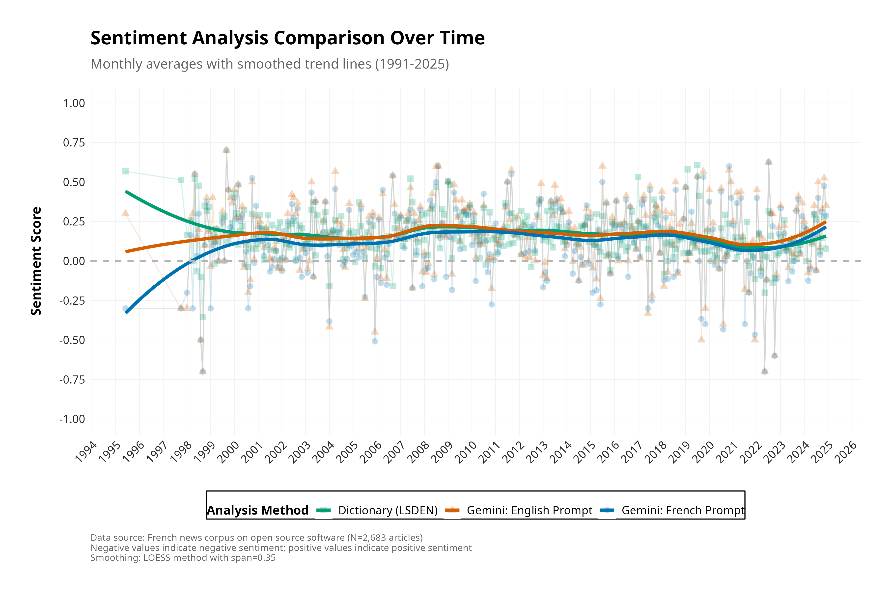

# Introduction

Computational text analysis in the social sciences grew up around English. Its tools, from sentiment dictionaries to topic models, were built for English text, a dominance that has been criticized for depressing comparative research and excluding scholarly communities that work in other languages [@badenThreeGapsComputational2022]. Comparativists coped by translating: machine translation made it possible to convert multilingual corpora into English and apply English-language tools [@lucasComputerAssistedTextAnalysis2015; @devriesNoLongerLost2018]. Large language models (LLMs) promise to loosen this constraint. Used without task-specific training, they match or exceed crowd workers and expert coders on common annotation tasks [@gilardiChatGPTOutperformsCrowd2023; @tornbergLargeLanguageModels2025], and they do so, with some loss, in languages other than English [@heseltineLargeLanguageModels2024; @rathjeGPTEffectiveTool2024].

Yet the way researchers use LLMs on non-English text often carries over two reflexes from the English-centered era. The first is to prompt in English, on the grounds that these models are trained mostly on English [@touvron_etal23a] and that English instructions have been found to work better even for non-English inputs [@laiChatGPTEnglishComprehensive2023; @Lin2022Few]. The second is to translate the text into English before analysis, a practice inherited from dictionary-based and bag-of-words methods that now reappears as "translate-test" with LLMs [@Etxaniz2024Multilingual]. Whether either reflex helps, harms, or makes no difference is unsettled. The evidence comes mostly from reasoning and classification benchmarks in natural language processing, often with older models and lower-resourced languages, and the social science evidence is thin.

This article tests both reflexes on a measurement task central to political communication research: sentiment analysis [@young_andsoroka12; @vanAtteveldt2021validity]. Sentiment is a demanding test for translation, because affective meaning is precisely what translation can alter [@Mohammad2016translation]. Using 200 manually annotated sentences from French news coverage, the study compares twelve open- and closed-weight LLMs under three conditions — French prompts on French text, English prompts on French text, and English prompts on machine-translated text — and benchmark them against the English and French versions of the Lexicoder Sentiment Dictionary. Equivalence tests allow the absence of a prompt-language effect to be assessed directly rather than inferred from non-significance.

The results speak to both reflexes. Prompt language made no meaningful difference. Translation, by contrast, cut both ways: it improved the dictionary but hurt the LLMs. The translation strategy that served English-bound tools does not carry over to models that can read the source language. The article also documents which models are viable for this task, including a practical lower bound on the size of open-weight models, and what they cost.

# Literature Review

## LLMs as Measurement Instruments in the Social Sciences

Zero-shot LLM annotation has moved quickly from curiosity to candidate standard. ChatGPT outperformed crowd workers on relevance, stance, topic, and frame detection [@gilardiChatGPTOutperformsCrowd2023]; GPT-4 outperformed expert coders and supervised classifiers at identifying the party of politicians from their social media posts across eleven countries [@tornbergLargeLanguageModels2025]; and GPT-4 closely approximated expert coding of negativity and sentiment in tweets from the United States, Chile, Germany, and Italy [@heseltineLargeLanguageModels2024]. Such results have fed broad claims that generative AI could transform computational social science [@ziemsCanLargeLanguage2024; @bailCanGenerativeAI2024], chiefly by removing the need for the thousands of annotated examples that supervised learning requires [@laurerLessAnnotatingMore2024; @chaeLargeLanguageModels2026].

A more cautious literature qualifies these claims on three fronts. First, performance is uneven. Across 25 English benchmarks, zero-shot LLMs did not outperform the best fine-tuned models on classification tasks [@ziemsCanLargeLanguage2024], and across 27 annotation tasks their performance was "highly contingent on both the dataset and the type of annotation task" [@pangakisAutomatedAnnotationGenerative2023]. Validation against human coding therefore remains indispensable [@grimmer_stewart13; @linNavigatingRisksUsing2026], and it is itself only as informative as the human gold standard is reliable [@songValidationsWeTrust2020]. Second, established tools retain advantages. Dictionaries generalize across domains and preserve gradations of sentiment [@vanderveenAdvantagesLexiconbasedSentiment2025], even though off-the-shelf dictionaries validate poorly against human judgment [@vanAtteveldt2021validity] and are outperformed by transformer-based models in German political and cultural texts [@widmannCreatingComparingDictionary2023; @klahnDictionariesLLMsEvaluation2025]; a domain-specific multilingual classifier can also match GPT-4o at a fraction of the cost [@mochtakParlasentMappingSentiment2025]. Third, reliance on proprietary models threatens reproducibility [@spirlingWhyOpensourceGenerative2023; @ollionDangersUsingProprietary2024], which has prompted calls to justify their use [@palmerUsingProprietaryLanguage2023] and evidence that open-weight models can be competitive alternatives [@alizadehOpensourceLLMsText2025; @klahnDictionariesLLMsEvaluation2025].

These debates leave the question of language largely implicit. The broadest evaluations rely on English benchmarks [@ziemsCanLargeLanguage2024]; studies that extend to other languages report somewhat lower performance outside English [@heseltineLargeLanguageModels2024; @tornbergLargeLanguageModels2025] but do not examine how researchers should interact with models in those languages. Even the most extensive multilingual evaluation in the social sciences, covering 12 languages, compared GPT with dictionary methods on English headlines only [@rathjeGPTEffectiveTool2024]. Two choices that researchers working in other languages must make — the language of the prompt and the language of the text — have been debated elsewhere.

## Prompting in English: Pivot Language or Multilingual Competence?

The case for prompting in English starts from the observation that LLMs are trained predominantly on English [@touvron_etal23a] and perform less well in other languages, especially lower-resourced ones [@laiChatGPTEnglishComprehensive2023; @ahujaMEGAMultilingualEvaluation2023]. A mechanistic account suggests why: in Llama-2 models, intermediate representations pass through an abstract "concept space" that lies closer to English than to other languages [@wendler_etal24]. If models effectively reason through English, instructions written in English should be understood best. Several findings support this pivot-language view. ChatGPT performed better with English prompts even when the task and input were in other languages [@laiChatGPTEnglishComprehensive2023]; English templates remedied the unexpectedly low accuracy of prompts handcrafted by native speakers [@Lin2022Few]; models fine-tuned on English prompts performed best with English prompts even on non-English samples [@Muennighoff2023Crosslingual]; asking models to restate a non-English request in English improved their multilingual performance [@huangNotAllLanguages2023]; and English instructions outperformed Arabic ones on average across eleven Arabic classification tasks [@Kmainasi2025Native].

A competing view emphasizes multilingual competence. Large models show strong multilingual reasoning abilities even in underrepresented languages [@shiLanguageModelsAre2022], and for capable models the language of the prompt appears to matter little. In the Arabic study just cited, differences across prompt languages were minimal for the strongest model, GPT-4o [@Kmainasi2025Native]; GPT-4 Turbo's labels for Indonesian tweets under English and Indonesian prompts agreed almost perfectly [@rathjeGPTEffectiveTool2024]; and changing the prompt language alters the length and wording of generated responses while their meaning remains largely stable [@nguyen_etal26]. The evidence on both sides comes mostly from reasoning and classification benchmarks, older models, and lower-resourced languages, and none of it tests whether prompt language affects the accuracy of a graded sentiment judgment in a well-resourced language. The two views imply competing expectations:

> **H1a (pivot language).** English prompts yield more accurate sentiment measurement of French text than French prompts.
>
> **H1b (multilingual competence).** English and French prompts yield equivalent performance on French text.

## Translating the Text: Bridge or Loss?

The second reflex predates LLMs. Faced with multilingual corpora, comparative researchers translated texts into English so that English-language tools could be applied [@lucasComputerAssistedTextAnalysis2015], and this bridge strategy has been validated repeatedly. Machine-translated and human-translated texts yield highly similar term-document matrices and topic models [@devriesNoLongerLost2018], results are robust across translation services [@reberOvercomingLanguageBarriers2019], and a machine translation of the Lexicoder dictionary captured legislative conflict across European parliaments [@prokschMultilingualSentimentAnalysis2019]. For sentiment specifically, translating non-English sentences into English and applying English methods performed as well as language-specific methods [@araujoComparativeStudyMachine2020], and sentiment analysis of English translations of Arabic posts was competitive with sentiment analysis of the originals [@Mohammad2016translation]. The logic has carried into the LLM era: translating inputs into English before inference improves the performance of multilingual models [@Etxaniz2024Multilingual], is often hard to beat for lower-resourced languages written in non-Latin scripts [@ahujaMEGAMultilingualEvaluation2023], and appears in applied research [@Venerito2024Large].

The opposing view treats translation as a source of loss. Translation alters sentiment: affective words disappear or are replaced by words of opposite valence, ambiguous words are mistranslated, and culturally specific expressions lose their meaning [@Mohammad2016translation]. Approaches that avoid translation altogether, such as multilingual dictionaries [@maierMachineTranslationVs2022] and multilingual sentence embeddings [@lichtCrossLingualClassificationPolitical2023], yield comparable or more reliable results in some settings. Crucially, the case for translation was built largely on tools that cannot read the source language, such as English dictionaries and bag-of-words models. For LLMs, which can, the supporting evidence comes from benchmarks whose non-English versions were themselves created by translation — a setting that, as the authors note, may favor translation-based methods — rather than from text written natively in the source language [@Etxaniz2024Multilingual]. Again, the two views imply competing expectations:

> **H2a (translation as bridge).** Analyzing English machine translations yields sentiment measurement at least as accurate as analyzing the French original.
>
> **H2b (translation as loss).** Analyzing English machine translations yields less accurate sentiment measurement than analyzing the French original.

## Research Questions

These debates motivate two research questions. **RQ1:** Does the language used to interact with the model — that of the prompt, or that of the text through machine translation — affect LLM sentiment measurement of French text? H1a–b and H2a–b offer competing answers. **RQ2:** Can general-purpose LLMs, open and closed-weight,^[While "open source" traditionally implies access aligned with FOSS principles, its usage within the LLM context often refers more specifically to the public release of model weights, a condition more accurately described as "open weights." This paper uses "open-weight" throughout.] measure sentiment in French text well enough, without fine-tuning, to be a viable alternative to dictionary-based methods? RQ2 is descriptive. The hypotheses were derived from the literature and were not preregistered.

# Data & Methods

## Data Collection and Preparation

The corpus consists of 2,683 French-language news articles from 13 media sources (9 from Québec, 1 from Ontario, 3 from France), an exhaustive collection of articles discussing open-source software from the Eureka database's "Major daily newspapers (FR)" category. Articles were selected using the search query below, over the period from January 1, 1991 — the release of the Linux kernel, the largest open-source project to date — to January 1, 2025. The start date excludes nothing in practice: the earliest matching article was published June 23, 1995.

```{.markdown .code-overflow-wrap}
TEXT= ("logiciel libre" | "logiciels libres" | "open source" | "open-source" | "logiciel
       open source" | "logiciels open source" | "code source ouvert" | "software libre"|
       "free software" | "code source libre" | "Free Software Foundation" | "Richard
       Stallman")
```

@tbl-source-summary shows the distribution of articles by source media.

::: {#tbl-source-summary}


Table: Summary of Collected News Articles Discussing Open Source Software by Source Media
:::

Articles were downloaded in HTML format with a Python/Selenium scraper (rather than as Eureka's default PDF batches, which are slow to retrieve and poorly suited to text analysis), and publication metadata and full-text content were extracted with custom R functions.


Figure 1 shows the temporal distribution of articles, with notable increases in coverage in the early 2000s corresponding to major open-source developments.

## Translation

To enable the EN→EN condition described below, which reproduces the translate-then-analyze strategy of comparative text analysis [@lucasComputerAssistedTextAnalysis2015; @devriesNoLongerLost2018], the French corpus was machine-translated into English using Google Translate's document translation service, processed in batches via an automated R workflow that preserved document IDs to keep French and English versions aligned in the final dataset.^[See `src/21_translate_to_english.R` in the project repository for the full translation pipeline.]

## Manual Annotation

A validation benchmark of 200 sentences was randomly sampled from the corpus, and each sentence was machine-translated into English via Google Translate and the `polyglotR` package. This sample size falls within the 100 to 300 units generally recommended for validating automated sentiment measures against a manually coded gold standard [@vanAtteveldt2021validity], and yields 95% confidence intervals of roughly ±0.05 around a correlation of 0.80. Three independent coders rated each sentence's sentiment on a scale from -1 (very negative) to 1 (very positive) using a custom Shiny application with keyboard shortcuts and scale reminders, and the three ratings were averaged to obtain the ground truth used to evaluate both dictionary-based and LLM methods.

Agreement between individual coders was moderate. Krippendorff's alpha (interval) was 0.597 (95% bootstrap CI [0.516, 0.656]), the mean pairwise correlation between coders was 0.687, and all three coders assigned the same sign (negative, zero, or positive) to only 42.5% of sentences. Two features of the task account for much of this: coders used a fine-grained scale (more than 60 distinct values), and most sentences carry mild sentiment, so small differences often cross zero. Because the ground truth averages three coders, it is considerably more reliable than any single coder: the Spearman-Brown projection from the mean pairwise correlation puts the reliability of the three-coder mean at 0.868. These levels nonetheless call for caution: simulations show that low intercoder reliability and small validation sets increase the risk of misjudging the performance of automated methods [@songValidationsWeTrust2020], a point taken up in the Limitations.

## Dictionary-Based Sentiment Analysis

Lexicon-based sentiment scoring was applied to both the French original and the English translation as a classical baseline. For French text, a customized version of the French Lexicoder Sentiment Dictionary (`frlsd`) [@duval_petry16] was applied to lowercased, stopword-removed, sentence-segmented text, scoring each sentence as (positive terms − negative terms) / total words. For English translations, the standard Lexicoder Sentiment Dictionary [@young_andsoroka12] was used with additional handling for contractions, proper nouns, and negation (e.g., "not good" scored as negative), scoring each sentence as ((positive + negated_negative) − (negative + negated_positive)) / total words. The two dictionaries therefore differ in construction as well as in language, which matters when they are compared.

## LLM-Based Sentiment Analysis

Twelve general-purpose foundational LLMs were evaluated, selected for prominence and affordability — realistic choices for researchers who need to analyze large corpora rather than a single sample. Given the reproducibility concerns raised by proprietary models, their inclusion requires justification [@palmerUsingProprietaryLanguage2023]: the three closed-weight models serve as a reference point, because the studies that established LLM annotation in the social sciences relied on proprietary GPT models [@gilardiChatGPTOutperformsCrowd2023; @heseltineLargeLanguageModels2024; @rathjeGPTEffectiveTool2024; @tornbergLargeLanguageModels2025].

The evaluation spans nine open-weight models — Llama 3.2 1B, Llama 3.2 3B, Llama 3.1 8B, GPT-OSS 20B, Qwen3 32B, Llama 4 Scout, GPT-OSS 120B, Qwen3 235B-A22B, and DeepSeek V3.2, ranging from 1B to 671B total parameters — and three closed-weight models: Claude Haiku 4.5 (Anthropic), Gemini 3.5 Flash (Google), and GPT-5.6 Luna (OpenAI). This lineup updates an initial 2024-2025 evaluation of 11 comparable models using an identical experimental design; several models from that original evaluation (e.g., GPT-4o, Gemini 2.0 Flash) had already been deprecated by their providers within eighteen months, underscoring how quickly this landscape moves. The smallest model, Llama 3.2 1B, rarely followed the instruction to answer with a number: about one call in 23 returned a parseable score, and even after retries it produced a usable score for only 58 to 74 of the 200 sentences, depending on the condition. It was retained deliberately: while models of around 8B parameters can handle the task, a 1B-parameter model appears too small to follow the instructions reliably at all, which marks a practical lower bound on model size. Its metrics rest on a reduced and non-random subset of sentences and are not directly comparable to those of the other models.

Each model was tested under three conditions to isolate the effects of prompt language and text language: French prompts on French text (FR→FR), English prompts on French text (EN→FR), and English prompts on the machine-translated English text (EN→EN).

All prompts followed a standardized structure: a task definition, a five-point sentiment scale from -1.0 to 1.0 with anchor descriptions (allowing intermediate values), an instruction to consider cultural and linguistic nuance, and a constraint to respond with only a numerical value. French prompts were direct translations of the English prompts. The English-prompt/French-text version is shown below.^[The French-prompt/French-text version is identical except for language; see `src/93_prompts.R` in the project repository for the exact prompts, and `src/40_prompt.R` for the full evaluation pipeline, including model initialization, retry logic, rate limiting, and checkpointing.]

```{.markdown .code-overflow-wrap}
en_prompt_fr_text <- function(text) {
  paste0("Please analyze the sentiment of the following French text and provide a single 
  numerical rating according to this scale:
Sentiment Scale:
-1.0: Strong negative sentiment - highly critical, hostile, or pessimistic content
-0.5: Moderate negative sentiment - somewhat negative, disapproving, or concerned 
      content
0.0: Neutral sentiment - factual, balanced, or neither positive nor negative content
0.5: Moderate positive sentiment - somewhat positive, approving, or optimistic content
1.0: Strong positive sentiment - highly supportive, enthusiastic, or optimistic content
You may also use values between these points for intermediate sentiment levels 
(e.g., -0.7, 0.3).
Important instructions:
1. First, carefully read and understand the text, considering cultural and linguistic 
   nuances in French.
2. Analyze the emotional tone, word choice, and overall message.
3. Respond ONLY with a single numerical value between -1.0 and 1.0 that best 
   represents the sentiment.
4. Do not include ANY explanations, analysis, or additional text in your response.
Here is the text to analyze: ", text)
}
```

Each model was queried via the `ellmer` R package, using the vendors' own APIs for the three closed-weight models and OpenRouter for the nine open-weight models, with responses capped at 400 tokens. Because OpenRouter can serve the same model through several providers at different numerical precisions, each open-weight model was pinned to a single named provider endpoint, at the highest precision offered, with fallback to other providers disabled.^[Endpoint pins, and the reasoning settings used to suppress chain-of-thought in models that reason by default, are listed in `src/94_models_map.R`.] Gemini 3.5 Flash was queried with its default settings, under which it generates reasoning tokens before answering (354 output tokens per call on average, against 7 for Claude Haiku 4.5). Each sentence was scored three times per model-condition combination (21,600 scores in total), and the mean of the three runs was taken as the final score. Despite explicit instructions to respond with a bare number, models frequently returned formatted text (e.g., "Sentiment: 0.5"); these responses were parsed with a pattern-matching function validated against the expected -1.0 to 1.0 range.

## Validation and Performance Evaluation

Performance was assessed with five complementary metrics: Pearson correlation between each model's continuous predictions and the manually annotated ground truth; Lin's concordance correlation coefficient (CCC), which, unlike Pearson correlation, also penalizes differences in scale and location, and so captures whether predictions reproduce the intensity of human ratings rather than only their ordering; mean absolute error (MAE); weighted F1 score on a 7-category classification ("very_negative" through "very_positive"); and weighted F1 score on a simplified 3-category classification (negative/neutral/positive) that groups the 7 categories into broad polarity bands. Weighted (rather than macro) F1 is used because the manually coded categories are unevenly distributed — "somewhat_positive" alone accounts for 44% of annotated sentences, while "very_negative" and "very_positive" each account for 1% or less — so a weighted average better reflects overall classification quality given this class imbalance. Comparing the two classification schemes separates fine-grained sentiment discrimination (7-category) from broad polarity classification (3-category). All metrics were calculated on complete cases only.

Condition comparisons are paired by model and map onto the hypotheses. The prompt-language hypotheses compare FR→FR with EN→FR, which hold the French text constant. The translation hypotheses compare EN→FR with EN→EN, which hold the English prompt constant and isolate the effect of analyzing the translation; the comparison of FR→FR with EN→EN contrasts the two complete workflows a researcher might adopt. Alongside paired t-tests, two one-sided tests (TOST) against an equivalence bound of ±0.05 on each metric's scale assess whether a difference is small enough to be treated as negligible, since a non-significant t-test cannot on its own establish the absence of an effect. These comparisons and the averages reported in the Results cover the eleven models that scored all 200 sentences (33 model-condition combinations) and exclude the dictionary baselines, which have no prompt. Llama 3.2 1B is reported separately: it scored a different, partial subset of sentences in each condition, so its differences across conditions would compare unlike samples.

# Results

## Prompt Language (H1a vs. H1b)

Holding the text constant, prompt language made no detectable difference. French prompts on French text (FR→FR) edged out English prompts on the same text (EN→FR) on every metric — mean correlation 0.700 vs. 0.673, MAE 0.209 vs. 0.217, 3-category F1 0.669 vs. 0.646, 7-category F1 0.364 vs. 0.347 — but none of these paired differences was statistically significant (all *p* > 0.12). Equivalence tests go further: FR→FR and EN→FR were statistically equivalent within ±0.05 on MAE (*p* = 0.002), 7-category F1 (*p* = 0.034), and 3-category F1 (*p* = 0.034). Correlation was the one metric where equivalence could not be established: the 90% confidence interval of the difference, [−0.032, 0.085], leaves room for a French-prompt advantage of up to 0.085, but not for an English-prompt advantage larger than 0.032. The results thus contradict H1a and support H1b on three of four metrics.

## Machine Translation (H2a vs. H2b)

For the LLMs, translation carried a cost. Holding the English prompt constant, analyzing the translation instead of the original (EN→EN vs. EN→FR) lowered 3-category F1 by 0.04 (0.646 vs. 0.606, *p* = 0.005); the accompanying drop in correlation (0.673 vs. 0.647) was not statistically significant (*p* = 0.24), and differences in MAE and 7-category F1 remained within the ±0.05 equivalence bound. Compared with the fully French workflow (FR→FR), the fully English workflow (EN→EN) lowered both correlation, by 0.053 (*p* = 0.007), and 3-category F1, by 0.063 (*p* < 0.001).

The dictionaries showed the opposite pattern. The English Lexicoder applied to the translation correlated with human judgments at r = 0.548, against 0.357 for the French Lexicoder applied to the original — a difference of 0.191 (95% bootstrap CI [0.059, 0.326]) — and also reached a higher 3-category F1 (0.588 vs. 0.557). Because the two dictionaries also differ in construction, this contrast does not isolate language, but its direction matches the bridge view. For the LLMs, the results contradict H2a and support H2b for polarity classification and, in the comparison of complete workflows, for correlation.

## Viability Against Dictionary Methods (RQ2)

General-purpose LLMs, used without fine-tuning, correlated with human judgments well above both dictionaries. The best configurations exceeded r = 0.80: GPT-5.6 Luna led on correlation (r = 0.810 in FR→FR) and concordance (CCC = 0.779), Claude Haiku 4.5 on both 3-category F1 (0.778) and 7-category F1 (0.537, both FR→FR), and Gemini 3.5 Flash on MAE (0.156 in EN→FR). Nine of the 33 model-condition combinations correlated with the ground truth more strongly than individual human coders agreed with the mean of the other two (mean leave-one-out r = 0.748, range 0.724–0.779).^[This comparison favors the models slightly, since the ground truth they are compared against averages three coders rather than two. Agreement between annotators is not a strict ceiling on machine performance [@richieInterannotatorAgreementNot2022].]


Closed-weight models outperformed open-weight ones on average (mean r = 0.768 vs. 0.638; 3-category F1 0.689 vs. 0.622), but the gap closed at the top of the open-weight range: Qwen3 235B-A22B reached r = 0.774 in FR→FR, above Gemini 3.5 Flash in the same condition, and GPT-OSS 120B and GPT-OSS 20B averaged r = 0.733 and 0.716 across conditions. Performance degraded below that. Llama 3.1 8B remained usable (r = 0.575–0.612), Llama 3.2 3B was erratic (r = 0.476 in FR→FR but 0.132 in EN→FR), and Llama 3.2 1B failed outright: it returned a usable score for only 58 to 74 sentences per condition, and on those its correlation with the ground truth ranged from −0.199 to 0.100. Cost was not a barrier: at list prices, scoring 1,000 sentences cost between USD 0.02 and 0.40 for every model but one (@tbl-cost); the exception, Gemini 3.5 Flash (USD 3.77), reflects the reasoning tokens it generates by default rather than its per-token price.

Against the LLM mean of r = 0.673, the dictionaries trailed on correlation (0.548 and 0.357) and on 3-category F1 (0.588 and 0.557 vs. 0.640), though the English dictionary outperformed Llama 3.2 3B and Qwen3 32B on the latter. The gap was widest on concordance: the LLMs averaged a CCC of 0.631, against 0.233 and 0.181 for the English and French dictionaries. On MAE, however, both dictionaries (0.203 and 0.210) did slightly better than the LLM average (0.213). This reflects the dictionaries' compressed output rather than accuracy: their scores cluster near zero (SD = 0.065 for the English dictionary, vs. 0.286 for the ground truth and 0.38–0.47 for the LLMs), which keeps absolute errors small on a sample dominated by mildly positive sentences while discriminating poorly between them.

## Classification Granularity

All models performed substantially better on 3-category than 7-category classification (best F1 of 0.778 vs. 0.537; mean 0.640 vs. 0.349; see Figure 3, below). Models most reliably identified positive and negative sentiment (7-category F1 = 0.482 and 0.441, rising to 0.690 and 0.627 in the 3-category scheme) and struggled most with the extreme categories (very_negative F1 = 0.256, very_positive F1 = 0.124), which are nearly absent from the sample (two sentences and one sentence respectively). Neutral remained the hardest 3-category label (F1 = 0.258).

```{=latex}
\clearpage
\begin{landscape}
\begin{figure}
\centering
\includegraphics[width=0.9\linewidth]{../../results/graphs/model_f1_scores_comparison_grouped_pub.png}
\caption{F1 Scores Comparison Across Models and Categories}
\label{fig:f1-scores}
\end{figure}
\end{landscape}
\clearpage
```

# Discussion

## Prompt Language: Multilingual Competence, Within Scope Conditions

For French and current models, the results side with the multilingual-competence view. English prompts brought no advantage, and equivalence tests ruled out any English-prompt gain larger than a few hundredths on every metric. This extends earlier social science evidence, which showed that labels agree across prompt languages [@rathjeGPTEffectiveTool2024], to the accuracy of those labels against human judgment, and it is consistent with the minimal differences observed for the strongest model in Arabic [@Kmainasi2025Native]. It does not refute the pivot-language evidence so much as delimit it. That evidence comes largely from reasoning and inference benchmarks, older or smaller models, and lower-resourced languages [@Lin2022Few; @Muennighoff2023Crosslingual; @laiChatGPTEnglishComprehensive2023], and the representational bias toward English it points to [@wendler_etal24] need not translate into worse instruction-following for a simple judgment in a language as well represented as French. The erratic behavior of the smaller open-weight models in this study — Llama 3.2 3B correlated with human judgments at r = 0.48 with French prompts but 0.13 with English ones — hints that sensitivity to prompt language may reappear below a certain model size, though a single model cannot establish this.

## Translation: A Bridge for Dictionaries, a Loss for LLMs

The translation results are the article's main contribution to the debate. The same machine translation that improved the dictionary lowered the LLMs' performance. This divergence reconciles the bridge and loss views rather than choosing between them: translation helps tools that cannot read the source language, and costs information for tools that can. The dictionary result is consistent with a long line of evidence that translating into English lets researchers use better-validated English resources [@araujoComparativeStudyMachine2020; @devriesNoLongerLost2018; @prokschMultilingualSentimentAnalysis2019]. For LLMs, which already read French, translation offers no such gain and exposes the analysis to the alterations of affective meaning that translation introduces [@Mohammad2016translation]. The finding runs against evidence that translating inputs into English improves multilingual models [@Etxaniz2024Multilingual], but that evidence rests on reasoning and inference benchmarks whose non-English versions were produced by translation, whereas the sentences analyzed here were written in French. The practical implication is direct: the translation step that dictionary-era workflows made necessary should not be carried into LLM-based sentiment analysis of French text.

## Viability: Optimism, With Validation

On RQ2, the results side with the optimistic literature [@gilardiChatGPTOutperformsCrowd2023; @tornbergLargeLanguageModels2025; @rathjeGPTEffectiveTool2024] and extend it in two directions. First, the advantage of LLMs over dictionaries holds against a native-language dictionary as well as a translated one, a comparison the multilingual evidence had so far made only in English. Second, open-weight models were viable from about 8B parameters, and the largest approached the best closed-weight models, consistent with evidence from German [@klahnDictionariesLLMsEvaluation2025]; below that size, performance became erratic, and a 1B-parameter model could not follow the task. For researchers weighing the reproducibility concerns raised by proprietary models [@spirlingWhyOpensourceGenerative2023; @ollionDangersUsingProprietary2024], this makes a credible open-weight option available at low cost.

The cautious literature is not thereby dismissed. Performance varied widely across models, which reinforces the need to validate each model on each task [@pangakisAutomatedAnnotationGenerative2023]. Two further results qualify the picture. First, the dictionaries' near-zero output gave them a slightly lower MAE than the LLMs — a reminder that MAE alone can reward a method that barely discriminates. Second, all models performed markedly worse on fine-grained 7-category classification than on 3-category polarity. These two results are compatible once ordering and calibration are distinguished. LLMs capture sentiment intensity in the sense of ordering sentences and reproducing the spread of human ratings: their concordance with the ground truth (mean CCC = 0.631, up to 0.779) far exceeds that of the dictionaries (0.233 and 0.181). What they do poorly is place scores on the right side of fixed category thresholds. They overstate extremes — 10.8% of LLM scores exceed ±0.66, against 1.5% of ground-truth values — so a sentence rated 0.5 by humans and 0.8 by a model is correctly ordered but misclassified. The ground truth contributes to the mismatch: as an average of three coders, it is pulled toward the center, leaving only three sentences in the two extreme categories. Gradations in sentiment are one of the main arguments made for dictionaries [@vanderveenAdvantagesLexiconbasedSentiment2025]; in this corpus, a single off-the-shelf dictionary captured them less well than the LLMs, though its transparency remains an advantage no model offers.

# Limitations

Several limitations qualify these findings. The benchmark is modest in size and reliability. Its 200 sentences fall within common recommendations for validating sentiment measures [@vanAtteveldt2021validity], but agreement between individual coders was moderate (Krippendorff's alpha = 0.597), and simulations show that such conditions raise the risk of misjudging automated methods [@songValidationsWeTrust2020]. Averaging three coders yields a more reliable ground truth, but it also pulls ratings toward the center, and only two sentences fall in the very negative category and one in the very positive, so class-level F1 scores for these categories are unstable. The findings concern French only: the corpus is French-language news on a single technical and political domain (open-source software), so neither the absence of a prompt-language effect nor the cost of translation can be assumed to extend to other languages, especially those less represented in training data, where the pivot-language evidence is strongest, or to other genres.

Methodologically, the EN→EN condition relies on Google Translate, and translation quality was deliberately not validated: the condition reproduces what a researcher who does not read English can do, namely translate automatically and analyze the result. Its lower performance should accordingly be read as the cost of that workflow rather than of translation as such. The dictionary comparison confounds language with dictionary construction. A single standardized prompt was used across models for comparability, which may understate the performance achievable with model-specific prompting, and the models tested do not include fine-tuned or domain-specific classifiers, which can rival general-purpose LLMs [@mochtakParlasentMappingSentiment2025]. Costs are reported at list prices and count cached prompt tokens at the full input rate, so they are upper bounds. Finally, this evaluation is a snapshot: several models from an earlier version of this study were deprecated within eighteen months, and the specific rankings should be expected to age quickly.

# Conclusion

Researchers analyzing French text with LLMs can set aside both inherited reflexes. The language of the prompt is a matter of convenience: English instructions brought no advantage, and equivalence tests rule out any substantial one. The language of the text is not: translating into English, the step that English-bound tools made necessary, improved the dictionary but lowered the LLMs' performance. The comparative strategy that served the dictionary era does not transfer to models that read the source language.

Two questions follow. The first is whether these results hold beyond French, particularly for languages less represented in training data, where the case for English prompts and translation is strongest; the design ports directly to such tests — the same three conditions, a manually annotated benchmark, a different target language. The second is whether the size threshold observed here, below which open-weight models become erratic and prompt-sensitive, is a stable feature of current models. Method choice remains a judgment about research goals rather than a ranking: dictionaries retain a transparency no model offers, and every model still needs to be validated on the task at hand. What the evidence here settles is narrower and, for researchers working with French text, useful: prompt in whichever language is convenient, and analyze the text in the language in which it was written.

# References {-}

::: {#refs}
:::

# Appendix {.appendix}


Figure 4 shows the Mean Absolute Error (MAE) results across models and conditions, providing complementary insights into prediction accuracy beyond correlation analysis.

::: {#tbl-cost}



Table: Cost of Scoring 1,000 Sentences at List Prices (Upper Bound; Cached Prompt Tokens Counted at the Full Input Rate)

:::



Figure 5 compares corpus-wide temporal sentiment trends captured by the best-performing LLM and by the Lexicoder Sentiment Dictionary, illustrating that the two methods track closely despite the LLM's higher correlation with sentence-level manual annotations.<!-- TODO: confirm which model generated this figure once the pipeline rerun completes (Gemini in the original batch) -->

\newpage

::: {#tbl-f1-3cat}



Table: F1 Scores for 3-Category Classification

:::

```{=latex}
\clearpage
\begin{landscape}
\begin{table}[h]
\caption{F1 Scores for 7-Category Classification}
\begin{center}
\input{../../results/tables/f1_scores_7cat_table.tex}
\end{center}
\end{table}
\end{landscape}
\clearpage
```
