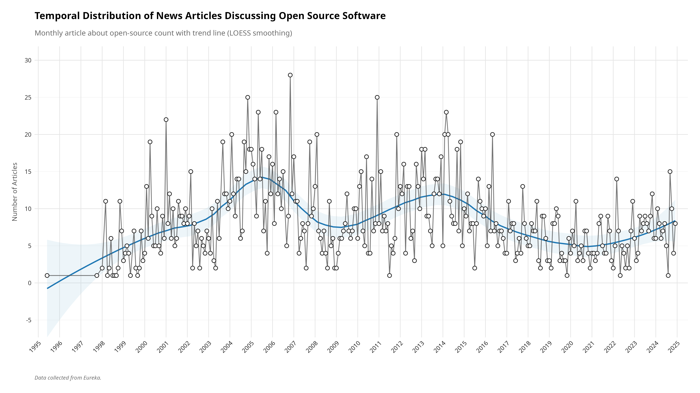
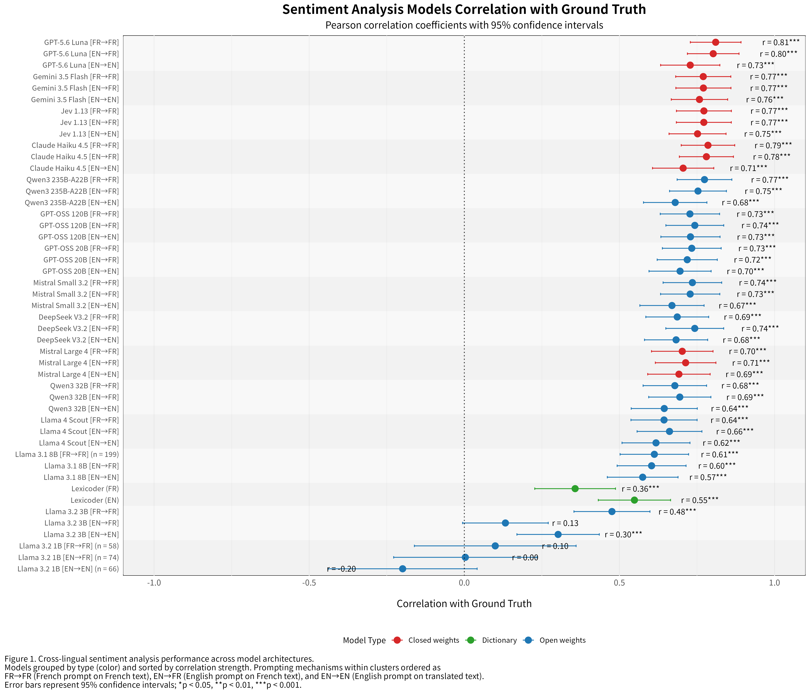
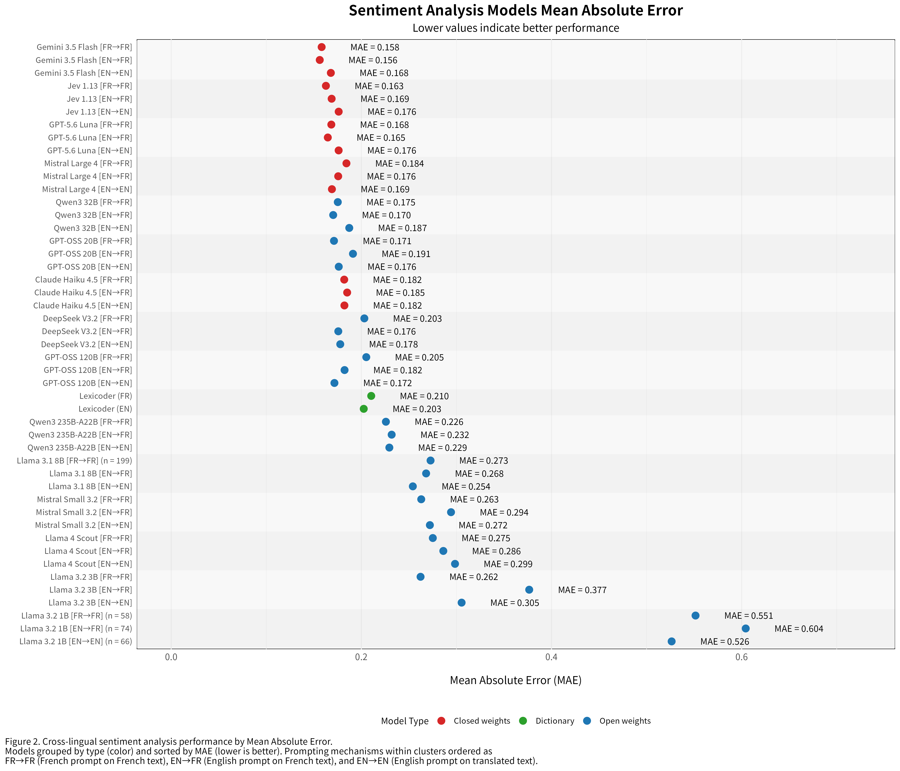
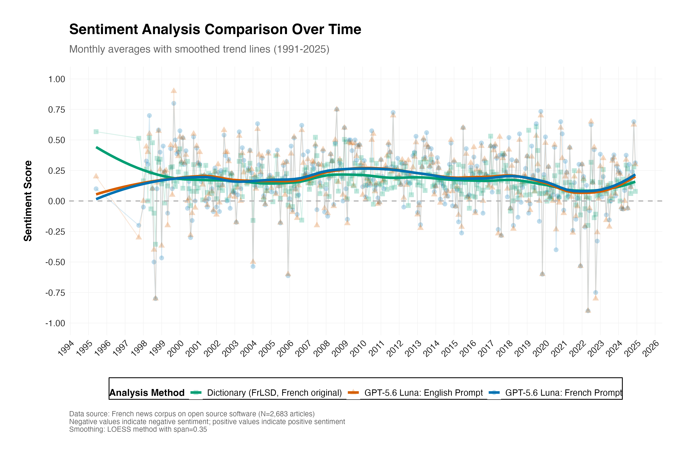

# Introduction

Computational text analysis in the social sciences grew up around English. Its tools, from sentiment dictionaries to topic models, were built for English text. This dominance has been criticized for depressing comparative research and for excluding scholarly communities that work in other languages [@badenThreeGapsComputational2022]. Comparativists coped by translating. Machine translation made it possible to convert multilingual corpora into English and to apply English-language tools [@lucasComputerAssistedTextAnalysis2015; @devriesNoLongerLost2018]. Large language models (LLMs) promise to loosen this constraint. Used without task-specific training, they match or exceed crowd workers and expert coders on common annotation tasks [@gilardiChatGPTOutperformsCrowd2023; @tornbergLargeLanguageModels2025]. They also do so, with some loss, in languages other than English [@heseltineLargeLanguageModels2024; @rathjeGPTEffectiveTool2024].

Yet researchers who use LLMs on non-English text often keep two reflexes from the English-centered era. The first is to prompt in English. The justification is that these models are trained mostly on English [@touvron_etal23a] and that English instructions have been found to work better even for non-English inputs [@laiChatGPTEnglishComprehensive2023; @Lin2022Few]. The second is to translate the text into English before analysis. This practice comes from dictionary and bag-of-words methods, and it reappears as "translate-test" with LLMs [@Etxaniz2024Multilingual]. Whether either reflex helps, harms, or makes no difference is unsettled. The evidence comes mostly from reasoning and classification benchmarks in natural language processing, often with older models and lower-resourced languages. The social science evidence is thin.

This article tests both reflexes on sentiment analysis, a measurement task central to political communication research [@young_andsoroka12; @vanAtteveldt2021validity]. Sentiment is a demanding test for translation, because affective meaning is precisely what translation can alter [@Mohammad2016translation]. The study uses 200 manually annotated sentences from French news coverage. It compares fifteen open- and closed-weight language models under three conditions: French prompts on French text, English prompts on French text, and English prompts on machine-translated text. The English and French versions of the Lexicoder Sentiment Dictionary serve as benchmarks. Equivalence tests assess the absence of a prompt-language effect directly, rather than inferring it from non-significance.

The results speak to both reflexes. Prompt language made no meaningful difference. Translation cut both ways: it improved the dictionary but hurt the LLMs. The translation strategy that served English-bound tools does not carry over to models that can read the source language. The article also answers a practical question: is a researcher working on French text still better served by a dictionary? On this evidence, no. Every model from about 8B parameters upward outperformed both the native French dictionary and the translated English one on correlation with human judgments, open-weight models included, for a few cents per thousand sentences. The dictionary retains transparency and stability. These make it a baseline rather than a primary measure.

# Literature Review

## LLMs as Measurement Instruments in the Social Sciences

Zero-shot LLM annotation has moved quickly from curiosity to candidate standard. ChatGPT outperformed crowd workers on relevance, stance, topic, and frame detection [@gilardiChatGPTOutperformsCrowd2023]. GPT-4 outperformed expert coders and supervised classifiers at identifying the party of politicians from their social media posts in eleven countries [@tornbergLargeLanguageModels2025]. GPT-4 also closely approximated expert coding of negativity and sentiment in tweets from the United States, Chile, Germany, and Italy [@heseltineLargeLanguageModels2024]. These results have fed broad claims that generative AI could transform computational social science [@ziemsCanLargeLanguage2024; @bailCanGenerativeAI2024], chiefly by removing the need for the thousands of annotated examples that supervised learning requires [@laurerLessAnnotatingMore2024; @chaeLargeLanguageModels2026].

A more cautious literature qualifies these claims on three fronts. First, performance is uneven. Across 25 English benchmarks, zero-shot LLMs did not outperform the best fine-tuned models on classification tasks [@ziemsCanLargeLanguage2024]. Across 27 annotation tasks, their performance was "highly contingent on both the dataset and the type of annotation task" [@pangakisAutomatedAnnotationGenerative2023]. Validation against human coding therefore remains indispensable [@grimmer_stewart13; @linNavigatingRisksUsing2026], and it is only as informative as the human gold standard is reliable [@songValidationsWeTrust2020]. Second, established tools retain advantages. Dictionaries generalize across domains and preserve gradations of sentiment [@vanderveenAdvantagesLexiconbasedSentiment2025]. However, off-the-shelf dictionaries validate poorly against human judgment [@vanAtteveldt2021validity], and transformer-based models outperform them in German political and cultural texts [@widmannCreatingComparingDictionary2023; @klahnDictionariesLLMsEvaluation2025]. A domain-specific multilingual classifier can also match GPT-4o at a fraction of the cost [@mochtakParlasentMappingSentiment2025]. Third, reliance on proprietary models threatens reproducibility [@spirlingWhyOpensourceGenerative2023; @ollionDangersUsingProprietary2024]. This has prompted calls to justify their use [@palmerUsingProprietaryLanguage2023] and evidence that open-weight models can be competitive alternatives [@alizadehOpensourceLLMsText2025; @klahnDictionariesLLMsEvaluation2025].

These debates leave the question of language largely implicit. The broadest evaluations rely on English benchmarks [@ziemsCanLargeLanguage2024]. Studies that extend to other languages report somewhat lower performance outside English [@heseltineLargeLanguageModels2024; @tornbergLargeLanguageModels2025], but they do not examine how researchers should interact with models in those languages. The most extensive multilingual evaluation in the social sciences covers 12 languages, yet it compared GPT with dictionary methods on English headlines only [@rathjeGPTEffectiveTool2024]. Researchers working in other languages must make two choices: the language of the prompt and the language of the text. Both have been debated elsewhere.

## Prompting in English: Pivot Language or Multilingual Competence?

The case for prompting in English starts from two observations. LLMs are trained predominantly on English [@touvron_etal23a], and they perform less well in other languages, especially lower-resourced ones [@laiChatGPTEnglishComprehensive2023; @ahujaMEGAMultilingualEvaluation2023]. A mechanistic account suggests why. In Llama-2 models, intermediate representations pass through an abstract "concept space" that lies closer to English than to other languages [@wendler_etal24]. If models effectively reason through English, instructions written in English should be understood best. Several findings support this pivot-language view. ChatGPT performed better with English prompts even when the task and input were in other languages [@laiChatGPTEnglishComprehensive2023]. English templates remedied the unexpectedly low accuracy of prompts handcrafted by native speakers [@Lin2022Few]. Models fine-tuned on English prompts performed best with English prompts even on non-English samples [@Muennighoff2023Crosslingual]. Asking models to restate a non-English request in English improved their multilingual performance [@huangNotAllLanguages2023]. English instructions outperformed Arabic ones on average across eleven Arabic classification tasks [@Kmainasi2025Native].

A competing view emphasizes multilingual competence. Large models show strong multilingual reasoning abilities even in underrepresented languages [@shiLanguageModelsAre2022]. For capable models, the language of the prompt appears to matter little. In the Arabic study just cited, differences across prompt languages were minimal for the strongest model, GPT-4o [@Kmainasi2025Native]. GPT-4 Turbo's labels for Indonesian tweets under English and Indonesian prompts agreed almost perfectly [@rathjeGPTEffectiveTool2024]. Changing the prompt language alters the length and wording of generated responses, while their meaning remains largely stable [@nguyen_etal26]. The evidence on both sides comes mostly from reasoning and classification benchmarks, older models, and lower-resourced languages. None of it tests whether prompt language affects the accuracy of a graded sentiment judgment in a well-resourced language. The two views imply competing expectations:

> **H1a (pivot language).** English prompts yield more accurate sentiment measurement of French text than French prompts.
>
> **H1b (multilingual competence).** English and French prompts yield equivalent performance on French text.

## Translating the Text: Bridge or Loss?

The second reflex predates LLMs. Faced with multilingual corpora, comparative researchers translated texts into English so that English-language tools could be applied [@lucasComputerAssistedTextAnalysis2015]. This bridge strategy has been validated repeatedly. Machine-translated and human-translated texts yield highly similar term-document matrices and topic models [@devriesNoLongerLost2018]. Results are robust across translation services [@reberOvercomingLanguageBarriers2019]. A machine translation of the Lexicoder dictionary captured legislative conflict across European parliaments [@prokschMultilingualSentimentAnalysis2019]. For sentiment specifically, translating non-English sentences into English and applying English methods performed as well as language-specific methods [@araujoComparativeStudyMachine2020], and sentiment analysis of English translations of Arabic posts was competitive with analysis of the originals [@Mohammad2016translation]. The logic has carried into the LLM era. Translating inputs into English before inference improves the performance of multilingual models [@Etxaniz2024Multilingual]. It is often hard to beat for lower-resourced languages written in non-Latin scripts [@ahujaMEGAMultilingualEvaluation2023], and it appears in applied research [@Venerito2024Large].

The opposing view treats translation as a source of loss. Translation alters sentiment: affective words disappear or are replaced by words of opposite valence, ambiguous words are mistranslated, and culturally specific expressions lose their meaning [@Mohammad2016translation]. Approaches that avoid translation, such as multilingual dictionaries [@maierMachineTranslationVs2022] and multilingual sentence embeddings [@lichtCrossLingualClassificationPolitical2023], yield comparable or more reliable results in some settings. Crucially, the case for translation was built largely on tools that cannot read the source language, such as English dictionaries and bag-of-words models. LLMs can. For them, the supporting evidence comes from benchmarks whose non-English versions were themselves created by translation, a setting that may favor translation-based methods, as the authors note [@Etxaniz2024Multilingual]. It does not come from text written natively in the source language. Again, the two views imply competing expectations:

> **H2a (translation as bridge).** Analyzing English machine translations yields sentiment measurement at least as accurate as analyzing the French original.
>
> **H2b (translation as loss).** Analyzing English machine translations yields less accurate sentiment measurement than analyzing the French original.

## Research Questions

These debates motivate two research questions. **RQ1:** Does the language used to interact with the model affect LLM sentiment measurement of French text? This covers the language of the prompt and the language of the text through machine translation. H1a–b and H2a–b offer competing answers. **RQ2:** Can general-purpose LLMs, open- and closed-weight,^["Open source" traditionally implies access aligned with free and open-source software principles. In the LLM context, the term usually refers to the public release of model weights. "Open-weight" describes this condition more accurately and is used throughout.] measure sentiment in French text well enough, without fine-tuning, to be a viable alternative to dictionary-based methods? RQ2 is descriptive. The hypotheses were derived from the literature and were not preregistered.

# Data & Methods

## Data Collection and Preparation

The corpus consists of 2,683 French-language news articles from 13 media sources (9 from Québec, 1 from Ontario, 3 from France). It is an exhaustive collection of the articles discussing open-source software in the Eureka database's "Major daily newspapers (FR)" category. Articles were selected with the search query below, over the period from January 1, 1991, the release year of the Linux kernel, to January 1, 2025. The start date excludes nothing in practice: the earliest matching article was published on June 23, 1995.

```{.markdown .code-overflow-wrap}
TEXT= ("logiciel libre" | "logiciels libres" | "open source" | "open-source" | "logiciel
       open source" | "logiciels open source" | "code source ouvert" | "software libre"|
       "free software" | "code source libre" | "Free Software Foundation" | "Richard
       Stallman")
```

@tbl-source-summary shows the distribution of articles by source media.

::: {#tbl-source-summary}


Table: Summary of Collected News Articles Discussing Open Source Software by Source Media
:::

Articles were downloaded in HTML format with a Python/Selenium scraper. Publication metadata and full text were extracted with custom R functions.



Figure 1 shows the temporal distribution of articles. Coverage rose markedly in the early 2000s.

## Translation

The EN→EN condition described below reproduces the translate-then-analyze strategy of comparative text analysis [@lucasComputerAssistedTextAnalysis2015; @devriesNoLongerLost2018]. For this condition, the French corpus was machine-translated into English with Google Translate's document translation service. An automated R workflow processed the documents in batches and preserved document IDs, so that the French and English versions remain aligned.^[See `src/21_translate_to_english.R` in the project repository.]

## Manual Annotation

A validation benchmark of 200 sentences was randomly sampled from the corpus. Each sentence was machine-translated into English with Google Translate through the `polyglotR` package. This sample size falls within the 100 to 300 units generally recommended for validating automated sentiment measures against a manually coded gold standard [@vanAtteveldt2021validity]. It yields 95% confidence intervals of roughly ±0.05 around a correlation of 0.80. Three independent coders rated the sentiment of each sentence on a scale from -1 (very negative) to 1 (very positive), using a custom Shiny application. The three ratings were averaged. This average is the ground truth against which both dictionary and LLM methods are evaluated.

Agreement between individual coders was moderate. Krippendorff's alpha (interval) was 0.597 (95% bootstrap CI [0.516, 0.656]). The mean pairwise correlation between coders was 0.687. All three coders assigned the same sign (negative, zero, or positive) to only 42.5% of sentences. Two features of the task account for much of this disagreement. Coders used a fine-grained scale with more than 60 distinct values, and most sentences carry mild sentiment, so small differences often cross zero. The ground truth averages three coders and is therefore more reliable than any single coder: the Spearman-Brown projection from the mean pairwise correlation puts the reliability of the three-coder mean at 0.868. These levels still call for caution. Simulations show that low intercoder reliability and small validation sets increase the risk of misjudging automated methods [@songValidationsWeTrust2020]. The Limitations section returns to this point.

## Dictionary-Based Sentiment Analysis

Lexicon-based scoring was applied to the French original and to the English translation as a classical baseline. For French text, a customized version of the French Lexicoder Sentiment Dictionary (`frlsd`) [@duval_petry16] was applied to lowercased, stopword-removed, sentence-segmented text. Each sentence was scored as (positive terms − negative terms) / total words. For the English translation, the standard Lexicoder Sentiment Dictionary [@young_andsoroka12] was used, with additional handling of contractions, proper nouns, and negation (for example, "not good" scored as negative). Each sentence was scored as ((positive + negated negative) − (negative + negated positive)) / total words. The two dictionaries therefore differ in construction as well as in language. This matters when they are compared.

## LLM-Based Sentiment Analysis

Fifteen general-purpose language models were evaluated. They were selected for prominence and affordability, as realistic choices for researchers who need to analyze large corpora. Proprietary models raise reproducibility concerns, so their inclusion requires justification [@palmerUsingProprietaryLanguage2023]. Three closed-weight models from the major vendors serve as a reference point: the studies that established LLM annotation in the social sciences relied on proprietary GPT models [@gilardiChatGPTOutperformsCrowd2023; @heseltineLargeLanguageModels2024; @rathjeGPTEffectiveTool2024; @tornbergLargeLanguageModels2025]. Three further models test specific claims. Mistral AI, a French developer, describes its models as particularly strong in French. It also reports that its Tekken tokenizer compresses French text about 30% more efficiently than its earlier tokenizer [@mistralaiMistralNeMo2024]. Two Mistral models test both claims. Jev tests a different kind of model, one that returns a probability for each answer rather than generated text.

The ten open-weight models are Llama 3.2 1B, Llama 3.2 3B, Llama 3.1 8B, GPT-OSS 20B, Mistral Small 3.2 24B, Qwen3 32B, Llama 4 Scout, GPT-OSS 120B, Qwen3 235B-A22B, and DeepSeek V3.2. They range from 1B to 671B total parameters. The five closed-weight models are Claude Haiku 4.5 (Anthropic), Gemini 3.5 Flash (Google), GPT-5.6 Luna (OpenAI), Mistral Large 4 (Mistral AI), and Jev 1.13 (TypeSafe). Mistral Large 4 was evaluated in the preview release of October 2026. Mistral has announced that its weights will be published, but they were not available at the time of writing, so it is classified as closed-weight here. Jev is not a text generator. It answers a typed question with a probability for each possible answer. It received the same task as the other models, posed as a question whose five answer levels are the five anchors of the sentiment scale, worded as in the prompts below and in the language of each condition. Its score is the probability-weighted average of the five levels, mapped onto the -1 to 1 scale. This lineup updates an initial 2024-2025 evaluation of 11 comparable models with an identical design. Several models from that evaluation, including GPT-4o and Gemini 2.0 Flash, were deprecated by their providers within eighteen months. The smallest model, Llama 3.2 1B, rarely followed the instruction to answer with a number. About one call in 23 returned a parseable score. Even after retries, it produced a usable score for only 58 to 74 of the 200 sentences, depending on the condition. It was retained deliberately. Models of around 8B parameters can handle the task, whereas a 1B model appears too small to follow the instructions reliably. This marks a practical lower bound on model size. Its metrics rest on a reduced and non-random subset of sentences and are not directly comparable to those of the other models.

Each model was tested under three conditions: French prompts on French text (FR→FR), English prompts on French text (EN→FR), and English prompts on the machine-translated English text (EN→EN). The first two conditions isolate the effect of prompt language. The last two isolate the effect of text language.

All prompts followed the same structure: a task definition, a five-point sentiment scale from -1.0 to 1.0 with anchor descriptions and intermediate values allowed, an instruction to consider cultural and linguistic nuance, and a constraint to respond with a numerical value only. French prompts were direct translations of the English prompts. The English-prompt/French-text version is shown below.^[The French-prompt/French-text version is identical except for language. See `src/93_prompts.R` in the project repository for the exact prompts, and `src/40_prompt.R` for the full evaluation pipeline, including model initialization, retry logic, rate limiting, and checkpointing.]

```{.markdown .code-overflow-wrap}
en_prompt_fr_text <- function(text) {
  paste0("Please analyze the sentiment of the following French text and provide a single 
  numerical rating according to this scale:
Sentiment Scale:
-1.0: Strong negative sentiment - highly critical, hostile, or pessimistic content
-0.5: Moderate negative sentiment - somewhat negative, disapproving, or concerned 
      content
0.0: Neutral sentiment - factual, balanced, or neither positive nor negative content
0.5: Moderate positive sentiment - somewhat positive, approving, or optimistic content
1.0: Strong positive sentiment - highly supportive, enthusiastic, or optimistic content
You may also use values between these points for intermediate sentiment levels 
(e.g., -0.7, 0.3).
Important instructions:
1. First, carefully read and understand the text, considering cultural and linguistic 
   nuances in French.
2. Analyze the emotional tone, word choice, and overall message.
3. Respond ONLY with a single numerical value between -1.0 and 1.0 that best 
   represents the sentiment.
4. Do not include ANY explanations, analysis, or additional text in your response.
Here is the text to analyze: ", text)
}
```

The generative models were queried through the `ellmer` R package. Claude Haiku 4.5, Gemini 3.5 Flash, and GPT-5.6 Luna were accessed through their vendors' APIs. The ten open-weight models and Mistral Large 4 were accessed through OpenRouter. Responses were capped at 400 tokens. OpenRouter can serve the same model through several providers at different numerical precisions. Each model accessed through OpenRouter was therefore pinned to a single named provider endpoint, at the highest precision offered, with fallback to other providers disabled. Mistral Large 4 is served only by Mistral itself.^[Endpoint pins, and the reasoning settings used to suppress chain-of-thought in models that reason by default, are listed in `src/94_models_map.R`. Mistral Large 4 reasons by default, exhausts the 400-token cap, and returns no answer. Its reasoning was disabled, as for Qwen3 32B and DeepSeek V3.2.] Gemini 3.5 Flash was queried with its default settings. Under these settings it generates reasoning tokens before answering: 354 output tokens per call on average, against 7 for Claude Haiku 4.5. Jev was queried through TypeSafe's API, with the model version pinned.^[See `src/42_jev_prompt.R` and `src/98_jev_helpers.R`.] Each sentence was scored three times per model and condition (27,000 scores in total), and the mean of the three runs was taken as the final score. Despite explicit instructions to respond with a bare number, the generative models frequently returned formatted text, such as "Sentiment: 0.5". These responses were parsed with a pattern-matching function, and only values within the -1.0 to 1.0 range were retained. Jev's answers needed no parsing.

To check whether the sentence-level findings hold at the scale of a real corpus, the best-performing model on the benchmark, GPT-5.6 Luna, also scored all 2,683 full articles under the FR→FR and EN→FR conditions, with the same prompts and settings.^[See `src/70_prompt_corpus.R`. The two passes required 5,366 API calls, 7.1 million input tokens and 187,000 output tokens, for USD 1.64 at list prices.] These scores are compared with the French Lexicoder dictionary in the Appendix (Figure 5).

## Validation and Performance Evaluation

Performance was assessed with four metrics: Pearson correlation between each model's continuous predictions and the ground truth; mean absolute error (MAE); weighted F1 on a 7-category classification, from "very negative" to "very positive"; and weighted F1 on a 3-category classification (negative, neutral, positive) that groups the 7 categories into polarity bands. Weighted rather than macro F1 is used because the manually coded categories are unevenly distributed. "Somewhat positive" alone accounts for 44% of annotated sentences, while "very negative" and "very positive" each account for 1% or less. Comparing the two classification schemes separates fine-grained discrimination (7 categories) from polarity classification (3 categories). All metrics were calculated on complete cases only.

Condition comparisons are paired by model and map onto the hypotheses. The prompt-language hypotheses compare FR→FR with EN→FR, which hold the French text constant. The translation hypotheses compare EN→FR with EN→EN, which hold the English prompt constant and isolate the effect of analyzing the translation. The comparison of FR→FR with EN→EN contrasts the two complete workflows a researcher might adopt. A non-significant t-test cannot by itself establish the absence of an effect. Alongside paired t-tests, two one-sided tests (TOST) therefore assess whether a difference is small enough to be treated as negligible, with an equivalence bound of ±0.05 on each metric's scale. These comparisons and the averages reported in the Results cover the fourteen models that scored all 200 sentences (42 model-condition combinations). They exclude the dictionary baselines, which have no prompt. Llama 3.2 1B is reported separately: it scored a different, partial subset of sentences in each condition, so comparisons across conditions would compare unlike samples.

# Results

## Prompt Language (H1a vs. H1b)

Holding the text constant, prompt language made no detectable difference. French prompts on French text (FR→FR) scored slightly higher than English prompts on the same text (EN→FR) on every metric: mean correlation 0.708 vs. 0.687, MAE 0.208 vs. 0.216, 3-category F1 0.674 vs. 0.656, and 7-category F1 0.381 vs. 0.363. None of these paired differences was statistically significant (all *p* > 0.10). Equivalence tests go further. FR→FR and EN→FR were statistically equivalent within ±0.05 on MAE (*p* < 0.001), 7-category F1 (*p* = 0.015), and 3-category F1 (*p* = 0.006). Correlation was the one metric on which equivalence could not be established. The 90% confidence interval of the difference, [−0.024, 0.066], leaves room for a French-prompt advantage of up to 0.066, but not for an English-prompt advantage larger than 0.024. The results contradict H1a and support H1b on three of four metrics.

## Machine Translation (H2a vs. H2b)

For the LLMs, translation carried a cost. Holding the English prompt constant, analyzing the translation instead of the original (EN→EN vs. EN→FR) lowered 3-category F1 by 0.035 (0.621 vs. 0.656, *p* = 0.004). The accompanying drop in correlation (0.659 vs. 0.687) was not statistically significant (*p* = 0.12). Differences in MAE and 7-category F1 remained within the ±0.05 equivalence bound. Compared with the fully French workflow (FR→FR), the fully English workflow (EN→EN) lowered correlation by 0.048 (*p* = 0.002) and 3-category F1 by 0.053 (*p* < 0.001).

The dictionaries showed the opposite pattern. The English Lexicoder applied to the translation correlated with human judgments at r = 0.548, against 0.357 for the French Lexicoder applied to the original. The difference is 0.191 (95% bootstrap CI [0.059, 0.326]). The English dictionary also reached a higher 3-category F1 (0.588 vs. 0.557). The two dictionaries also differ in construction, so this contrast does not isolate language. Its direction nonetheless matches the bridge view. For the LLMs, the results contradict H2a and support H2b for polarity classification and, in the comparison of complete workflows, for correlation.

## Viability Against Dictionary Methods (RQ2)

General-purpose LLMs, used without fine-tuning, correlated with human judgments well above both dictionaries. The best configurations exceeded r = 0.80. GPT-5.6 Luna led on correlation (r = 0.810 in FR→FR). Claude Haiku 4.5 led on 3-category F1 (0.778) and 7-category F1 (0.537), both in FR→FR. Gemini 3.5 Flash led on MAE (0.156 in EN→FR). Jev came close behind the leaders. It reached r = 0.772 in both conditions on French text and the second-highest 7-category F1 (0.528 in EN→FR). Twelve of the 42 model-condition combinations correlated with the ground truth more strongly than individual human coders agreed with the mean of the other two (mean leave-one-out r = 0.748, range 0.724–0.779).^[This comparison slightly favors the models, because the ground truth they are compared against averages three coders rather than two. Agreement between annotators is not a strict ceiling on machine performance [@richieInterannotatorAgreementNot2022].]



Closed-weight models outperformed open-weight ones on average (mean r = 0.754 vs. 0.646; 3-category F1 0.685 vs. 0.632). The gap closed at the top of the open-weight range. Qwen3 235B-A22B reached r = 0.774 in FR→FR, above Gemini 3.5 Flash in the same condition. GPT-OSS 120B and GPT-OSS 20B averaged r = 0.733 and 0.716 across conditions. Mistral Small 3.2 reached the highest 3-category F1 of any open-weight model (0.721 in FR→FR), although its scores sat further from the human ratings (MAE 0.263 to 0.294). Mistral's newest flagship did not lead its own family. Mistral Large 4 scored below Mistral Small 3.2 on correlation (r = 0.692 to 0.713) and 3-category F1 (0.609 to 0.624), though with a lower MAE. Performance degraded at smaller sizes. Llama 3.1 8B remained usable (r = 0.575–0.612). Llama 3.2 3B was erratic (r = 0.476 in FR→FR but 0.132 in EN→FR). Llama 3.2 1B failed: it returned a usable score for only 58 to 74 sentences per condition, and on those its correlation with the ground truth ranged from −0.199 to 0.100. Cost was not a barrier. At list prices, scoring 1,000 sentences cost between USD 0.02 and 0.40 for every model but one (@tbl-cost). The exception, Gemini 3.5 Flash (USD 3.77), reflects the reasoning tokens it generates by default rather than its per-token price.^[No cost is reported for Llama 3.2 1B. Its endpoint returned the same input token count on every call regardless of the prompt, so its usage was not measured. It needed 22.7 API calls per usable score, against 1.0 to 1.03 for every other model, and would in any case have been the most expensive open-weight model to run.]

Against the LLM mean of r = 0.685, the dictionaries trailed on correlation (0.548 and 0.357) and on 3-category F1 (0.588 and 0.557 vs. 0.651). On correlation, the comparison is one-sided: every model from 8B parameters upward exceeded both dictionaries in every condition, and only Llama 3.2 3B and 1B fell below them. On 3-category F1, the translated English dictionary outperformed Qwen3 32B in every condition, GPT-OSS 120B in EN→EN, and the two smallest Llama models. On MAE, both dictionaries (0.203 and 0.210) did slightly better than the LLM average (0.211). This reflects the dictionaries' compressed output rather than their accuracy. Their scores cluster near zero (SD = 0.065 for the English dictionary, against 0.286 for the ground truth and 0.30 to 0.49 for the models from 8B parameters upward). On a sample dominated by mildly positive sentences, this keeps absolute errors small while discriminating poorly between sentences.

## Classification Granularity

All models performed substantially better on 3-category than on 7-category classification (best F1 0.778 vs. 0.537; mean 0.651 vs. 0.369; Figure 3). Models identified positive and negative sentiment most reliably (7-category F1 = 0.480 and 0.454, rising to 0.706 and 0.626 in the 3-category scheme). They struggled most with the extreme categories (very negative F1 = 0.260, very positive F1 = 0.135), which are nearly absent from the sample (two sentences and one sentence). Neutral remained the hardest 3-category label (F1 = 0.272).

```{=latex}
\clearpage
\begin{landscape}
\begin{figure}
\centering
\includegraphics[width=0.9\linewidth]{../../results/graphs/model_f1_scores_comparison_grouped_pub.png}
\caption{F1 Scores Comparison Across Models and Categories}
\label{fig:f1-scores}
\end{figure}
\end{landscape}
\clearpage
```

# Discussion

## Prompt Language: Multilingual Competence, Within Scope Conditions

For French and current models, the results side with the multilingual-competence view. English prompts brought no advantage, and equivalence tests ruled out any English-prompt gain larger than a few hundredths on every metric. Earlier social science evidence showed that labels agree across prompt languages [@rathjeGPTEffectiveTool2024]. This study extends that finding to the accuracy of the labels against human judgment. It is also consistent with the minimal differences observed for the strongest model in Arabic [@Kmainasi2025Native]. The results do not refute the pivot-language evidence so much as delimit it. That evidence comes largely from reasoning and inference benchmarks, older or smaller models, and lower-resourced languages [@Lin2022Few; @Muennighoff2023Crosslingual; @laiChatGPTEnglishComprehensive2023]. The representational bias toward English that it points to [@wendler_etal24] need not produce worse instruction-following for a simple judgment in a language as well represented as French. The smaller open-weight models behaved differently. Llama 3.2 3B correlated with human judgments at r = 0.48 with French prompts but 0.13 with English ones. This suggests that sensitivity to prompt language may reappear below a certain model size, although a single model cannot establish this. At the scale of the full corpus, the equivalence of prompt languages is even clearer. GPT-5.6 Luna's scores for the 2,683 articles under French and English prompts correlated at r = 0.97, and 94% of articles received the same sign (Figure 5).

Prompt language does carry a cost that the accuracy results do not show. The French prompt is 6% longer than the English one in characters, yet it cost 10% to 34% more input tokens, depending on the model (@tbl-tokens).^[Jev's input is TypeSafe's structured question rather than the prompt shown above, so its token counts do not measure the same text. It is left out of the tokenizer comparisons in this paragraph.] The difference is a property of each model's tokenizer, not of its size or licence. Vocabularies that favor English encode English text with similar efficiency across models (1.17 to 1.25 tokens per word). They split French words into more pieces, at rates from 1.38 tokens per word (Mistral Large 4) to 1.87 (Claude Haiku 4.5). @ahiaAllLanguagesCost2023 document the same disparity across many languages. Mistral's claim of a tokenizer that is cheaper on French [@mistralaiMistralNeMo2024] held for one of its two models. Mistral Large 4 encoded French more compactly than any other model and had the smallest French-prompt overhead (10%). Mistral Small 3.2 did not stand out (1.45 tokens per French word, a 15% overhead). The French sentences themselves cost 1.6% to 4.6% more tokens than their English translations. Output length did not differ by prompt language. Since accuracy was equivalent, the English prompt is the cheaper of two equally good options. The saving depends on where a model's cost lies. It is 14% to 31% per 1,000 sentences for most models billed mostly on input (Claude Haiku 4.5, Llama 3.x, Qwen3, DeepSeek V3.2, Llama 4 Scout, Mistral Small 3.2). It is 10% for Mistral Large 4, whose French overhead is smallest. It is under 6% for GPT-5.6 Luna, the GPT-OSS models, and Gemini 3.5 Flash, whose output tokens weigh more. Translating the text first would save a few percent more, at the accuracy cost reported above.

## Translation: A Bridge for Dictionaries, a Loss for LLMs

The translation results are the article's main contribution to the debate. The same machine translation that improved the dictionary lowered the LLMs' performance. This divergence reconciles the bridge and loss views rather than choosing between them. Translation helps tools that cannot read the source language, and it costs information for tools that can. The dictionary result is consistent with a long line of evidence that translating into English lets researchers use better-validated English resources [@araujoComparativeStudyMachine2020; @devriesNoLongerLost2018; @prokschMultilingualSentimentAnalysis2019]. LLMs already read French. For them, translation offers no such gain, and it exposes the analysis to the alterations of affective meaning that translation introduces [@Mohammad2016translation]. The finding runs against evidence that translating inputs into English improves multilingual models [@Etxaniz2024Multilingual]. That evidence rests on reasoning and inference benchmarks whose non-English versions were produced by translation. The sentences analyzed here were written in French. The practical implication is direct: the translation step that dictionary-era workflows made necessary should not be carried into LLM-based sentiment analysis of French text.

## Viability: Optimism, With Validation

On RQ2, the results side with the optimistic literature [@gilardiChatGPTOutperformsCrowd2023; @tornbergLargeLanguageModels2025; @rathjeGPTEffectiveTool2024] and extend it in two directions. First, the advantage of LLMs over dictionaries holds against a native-language dictionary as well as a translated one. The multilingual evidence had so far made this comparison only in English. Second, open-weight models were viable from about 8B parameters, and the largest approached the best closed-weight models. This is consistent with evidence from German [@klahnDictionariesLLMsEvaluation2025]. Below that size, performance became erratic, and a 1B-parameter model could not follow the task. For researchers weighing the reproducibility concerns raised by proprietary models [@spirlingWhyOpensourceGenerative2023; @ollionDangersUsingProprietary2024], this makes a credible open-weight option available at low cost. Qwen3 235B-A22B and GPT-OSS 120B reached 90–95% of the best closed-weight correlation for USD 0.02–0.03 per thousand sentences. Models from a French developer showed no French advantage. Neither Mistral model did notably better with French prompts (r = 0.702 vs. 0.713 for Mistral Large 4 and 0.735 vs. 0.728 for Mistral Small 3.2, FR→FR vs. EN→FR), and both trailed the leading closed-weight models. A different kind of model also proved viable. Jev, which returns a probability for each point of the scale rather than generated text, came within 0.04 of the best correlation for about USD 0.02 per thousand sentences. For French text, the answer to RQ2 is therefore yes. A general-purpose LLM measures sentiment better than the Lexicoder dictionary on every criterion that rewards discrimination, and the cost of running one is no longer a reason to prefer the dictionary.

The cautious literature is not dismissed. Performance varied widely across models, which reinforces the need to validate each model on each task [@pangakisAutomatedAnnotationGenerative2023]. Two further results qualify the picture. First, the dictionaries' near-zero output gave them a slightly lower MAE than the LLMs. MAE alone can thus reward a method that barely discriminates. Second, all models performed markedly worse on 7-category classification than on 3-category polarity. These two results are compatible once ordering and calibration are distinguished. LLMs order sentences and reproduce the spread of human ratings. Their correlation with the ground truth (mean r = 0.685, up to 0.810) far exceeds that of the dictionaries (0.548 and 0.357). From 8B parameters upward, their scores spread at least as widely as the human ratings (SD 0.30 to 0.49 vs. 0.286), whereas the dictionaries' scores cluster near zero (SD = 0.065 for the English dictionary). What LLMs do poorly is place scores on the right side of fixed category thresholds. They overstate extremes: 10.6% of LLM scores exceed ±0.66, against 1.5% of ground-truth values. A sentence rated 0.5 by humans and 0.8 by a model is correctly ordered but misclassified. The ground truth contributes to the mismatch. As an average of three coders, it is pulled toward the center, and only three sentences fall in the two extreme categories. Gradations in sentiment are one of the main arguments for dictionaries [@vanderveenAdvantagesLexiconbasedSentiment2025]. In this corpus, a single off-the-shelf dictionary captured them less well than the LLMs. The gap does not close with aggregation. On the full corpus, the French dictionary's article scores correlated with GPT-5.6 Luna's at r = 0.36, and their monthly averages at r = 0.42 (Figure 5). What the dictionary retains is transparency, since every score can be traced to the words that produced it, and stability over time, since a dictionary is not deprecated. These make it a useful baseline and robustness check alongside an LLM. They are not a reason to prefer it as the primary measure.

# Limitations

Several limitations qualify these findings. The benchmark is modest in size and reliability. Its 200 sentences fall within common recommendations for validating sentiment measures [@vanAtteveldt2021validity], but agreement between individual coders was moderate (Krippendorff's alpha = 0.597). Simulations show that such conditions raise the risk of misjudging automated methods [@songValidationsWeTrust2020]. Averaging three coders yields a more reliable ground truth, but it also pulls ratings toward the center. Only two sentences fall in the very negative category and one in the very positive, so class-level F1 scores for these categories are unstable. The findings concern French only. The corpus is French-language news on a single domain, open-source software. Neither the absence of a prompt-language effect nor the cost of translation can be assumed to extend to other languages or genres. This applies especially to languages less represented in training data, where the pivot-language evidence is strongest.

Methodologically, the EN→EN condition relies on Google Translate, and translation quality was deliberately not validated. The condition reproduces what a researcher who does not read the source language can do: translate automatically and analyze the result. Its lower performance should be read as the cost of that workflow rather than of translation as such. The dictionary comparison confounds language with dictionary construction. A single standardized prompt was used across the generative models for comparability. This may understate the performance achievable with model-specific prompting. Jev received the same scale in a different format, and its score is a probability-weighted average. Such averages are pulled toward the middle of the scale, which can lower MAE without improving discrimination, so Jev's MAE should be read with care. Mistral Large 4 was evaluated as a preview release, which may change before its general availability. The models tested do not include fine-tuned or domain-specific classifiers, which can rival general-purpose LLMs [@mochtakParlasentMappingSentiment2025]. Costs are reported at list prices and count cached prompt tokens at the full input rate, so they are upper bounds. Finally, this evaluation is a snapshot. Several models from an earlier version of this study were deprecated within eighteen months, and the specific rankings should be expected to age quickly.

# Conclusion

Researchers analyzing French text with LLMs can set aside both inherited reflexes. The language of the prompt is a matter of convenience. English instructions brought no advantage, and equivalence tests rule out any substantial one. The language of the text is not a matter of convenience. Translating into English, the step that English-bound tools made necessary, improved the dictionary but lowered the LLMs' performance. The comparative strategy that served the dictionary era does not transfer to models that read the source language.

Two questions follow. The first is whether these results hold beyond French, particularly for languages less represented in training data, where the case for English prompts and translation is strongest. The design ports directly to such tests: the same three conditions, a manually annotated benchmark, and a different target language. The second is whether the size threshold observed here, below which open-weight models become erratic and prompt-sensitive, is a stable feature of current models.

On the practical question of whether a researcher working on French text is still better served by a dictionary, the answer here is no. A general-purpose LLM validated on a manually annotated sample measures sentiment better than the Lexicoder dictionary on every criterion but transparency. Open-weight models from about 8B parameters do so for a few cents per thousand sentences. The dictionary keeps two advantages, transparency and stability over time. These make it a baseline and a robustness check rather than the primary measure. Every model still needs to be validated on the task at hand. For researchers working with French text, the evidence settles three points: use a validated LLM, prompt in whichever language is convenient, and analyze the text in the language in which it was written.

# References {-}

::: {#refs}
:::

# Appendix {.appendix}



Figure 4 shows the mean absolute error (MAE) across models and conditions.

::: {#tbl-cost}



Table: Cost of Scoring 1,000 Sentences at List Prices (Upper Bound; Cached Prompt Tokens Counted at the Full Input Rate; Input Tokens and Cost Not Reported for Llama 3.2 1B, Whose Endpoint Returned a Constant Token Count)

:::

::: {#tbl-tokens}



Table: Mean Input Tokens per API Call by Language Condition, and Tokens per Word by Text Language (Valid Calls Only; Llama 3.2 1B Excluded Because Its Endpoint Reported a Constant Token Count on Every Call; Jev's Input Is a Structured Question Rather Than the Text Prompt, So Its Counts Are Not Comparable)

:::



Figure 5 shows monthly mean sentiment for the 2,683 articles, scored by GPT-5.6 Luna with French prompts and with English prompts, and by the French Lexicoder dictionary on the original text. Points are monthly means and curves are LOESS smooths. The two prompt languages produce nearly identical series (r = 0.97 across 322 months). The dictionary agrees with the model only weakly (r = 0.42 across months, 0.36 across articles). The smoothed curves look alike because none of the three series shows a strong trend, not because the dictionary and the model agree on individual months.

\newpage

::: {#tbl-f1-3cat}



Table: F1 Scores for 3-Category Classification

:::

```{=latex}
\clearpage
\begin{landscape}
\begin{table}[h]
\caption{F1 Scores for 7-Category Classification}
\begin{center}
{\scriptsize\renewcommand{\arraystretch}{0.95}
\input{../../results/tables/f1_scores_7cat_table.tex}}
\end{center}
\end{table}
\end{landscape}
\clearpage
```
